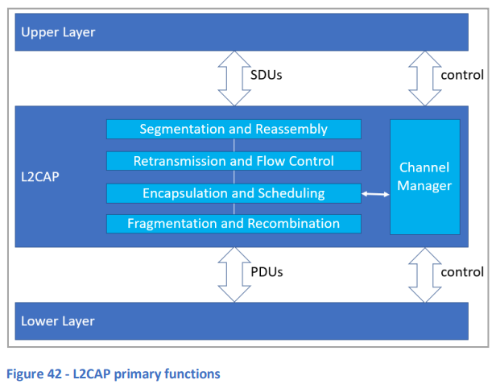

# 10. 論理リンク制御および適応プロトコル (L2CAP)

## 10.1 基本事項
**論理リンク制御および適応プロトコル (L2CAP)** は、プロトコルの多重化、フロー制御、サービスデータユニット (SDU) の分割および再結合を担当しています。

L2CAPは、スタックの層間でやり取りされるパケットのシーケンスを分離するために**チャネル**の概念を使用します。固定チャネルはセットアップを必要とせず、即座に利用可能であり、特定の上位層プロトコルに関連付けられます。また、チャネルは動的に作成され、指定された**プロトコルサービスマルチプレクサ (PSM)** 値を通じてプロトコルに関連付けられることもあります。

**図42**は、L2CAPの主な機能を示しています。

  
**図42 - L2CAPの主な機能**

### 10.2 L2CAPとプロトコルの多重化
L2CAPの上位には、**属性プロトコル (ATT)** や**セキュリティマネージャプロトコル (SMP)** のように、異なるプロトコルを使用する層が存在します。L2CAPプロトコルの多重化は、SDUが正しい層に渡され、適切に処理されるようにします。

L2CAPチャネルが属性プロトコルを処理している場合、ATT用に予約された固定チャネルを使用して動作することがあり、この場合は**非拡張ATTベアラ**として動作するといいます。また、一連の動的チャネルを使用し、各チャネルが**拡張ATTベアラ**として動作する場合もあります。非拡張ATTベアラは、1つずつ順番に実行されるATTトランザクションをサポートしますが、拡張ATTベアラは、並列L2CAPチャネル内で順次実行される複数の並列ATTトランザクションをサポートします。詳細については、**11. 属性プロトコル**のセクションを参照してください。

### 10.3 L2CAPとフロー制御
**フロー制御**は、スタックのある層が生成するパケットのレートが、同じスタック内またはリモートデバイス上の別の層が処理できるレートを超えないようにすることです。フロー制御がないと、バッファオーバーフローなどの問題が発生する可能性があります。

フロー制御の1つの方法として**クレジットベースのフロー制御**があります。概要は次のとおりです：
- **送信デバイス**は、受信デバイスがデータを失うことなく処理できるPDUの数（たとえば、バッファの容量）を事前に把握します。この情報は、データ転送開始前に、構成またはデバイス間の交換を通じて取得されます。
- **送信者**はカウンターを受信側の容量制限に設定し、PDUが送信されるたびにカウンターが減少します。カウンターが0になると、送信者は受信者がいっぱいであることを認識し、受信者が処理を進めるまで一時的に送信を停止します。
- **受信者**がバッファから1つ以上のPDUを読み取り処理した後、その数に応じたクレジットが送信者に返され、カウンターが増加します。カウンターが0以外の値になると、送信者は再びPDUの送信を続けることができます。

L2CAPは、複数の動作モードを定義しており、主にフロー制御に関係しています。たとえば、非拡張ATTベアラ上で動作するATTは**基本L2CAPモード**を使用し、これはフロー制御を提供しません。これにより、ATTは信頼性がなく、送信されたATT PDUが受信デバイスによって失われる可能性があります。一方、拡張ATTベアラ上のATTは、**拡張クレジットベースのフロー制御モード**を使用し、信頼性が高くなります。

### 10.4 L2CAPの分割と再結合
L2CAPを含む層は、それぞれ**最大転送単位 (MTU)** サイズが指定されており、各層で作成されるPDUの最大サイズが決められています。たとえば、**ATT_MTU**パラメータは、ATT PDUの最大サイズを定義します。

L2CAP自身とそれに隣接する層は異なるMTUサイズを持つことがあるため、上位または下位の層に合わせてPDUやSDUを分割する必要がある場合があります。このプロセスは、L2CAPが上位層に対して適用する場合は**セグメンテーションと再結合**と呼ばれ、下位層に対して適用する場合は**フラグメンテーションと再結合**と呼ばれます。
