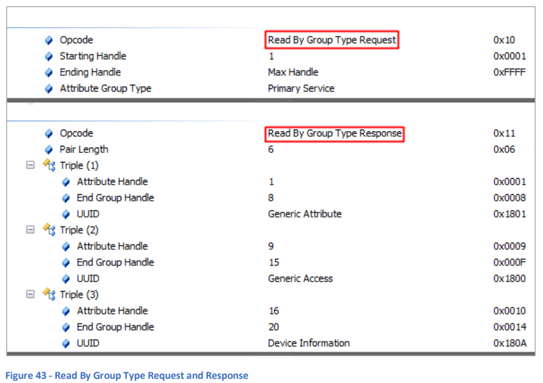
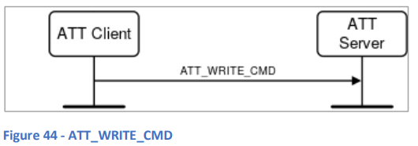
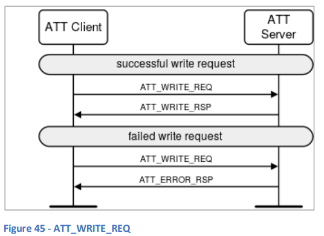
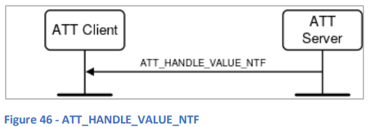
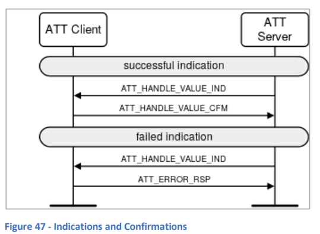
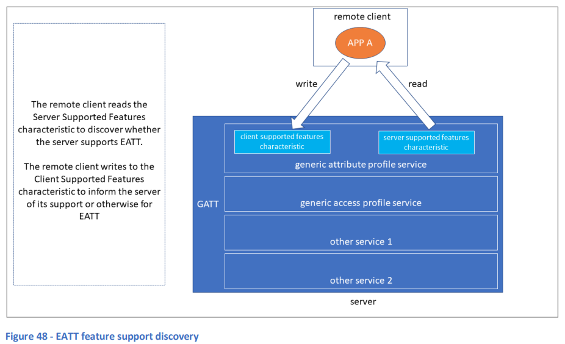

# 11. 属性プロトコル (ATT)

## 11.1 基本事項
**属性プロトコル (ATT)** は、クライアントの役割を果たすデバイスと、サーバの役割を果たすデバイスとの間で使用されます。サーバは、**属性**と呼ばれる一連の複合データ項目を公開します。属性は、サーバによってインデックス付きリストとして整理され、これを**属性テーブル**と呼びます。

各属性には、以下の要素が含まれます：
- **ハンドル**：ATTクライアントが属性テーブル内の特定のエントリを参照するための一意のインデックス値。
- **UUID (ユニバーサリーユニーク識別子)**：属性のタイプを識別。
- **パーミッションフィールド**：読み取り、書き込み、またはその両方のアクセスが許可されているか、アクセスに必要なセキュリティ条件を示すフラグのセット。
- **属性値フィールド**：バイト配列で構成され、属性の値を含む。このバイト配列のデータ型とセマンティクスの解釈は、スタックの上位層の責任です。

**汎用属性プロファイル (GATT)** は、属性が**サービス**、**キャラクタリスティック**、**ディスクリプタ**といった高次の概念をどのように表すかを定義しています。通常、これらの複雑なタイプを表すためには、連続したハンドル値の範囲内で複数の属性を必要とし、ATTはこのためにハンドル値の範囲を指定して属性のグループを扱うことをサポートしています。詳細は**12. 汎用属性プロファイル**を参照してください。

ATTクライアントは、サーバの属性テーブルの詳細を発見し、関心のある属性や属性タイプのハンドル値を特定するためにATTを使用します。たとえば、**ATT_READ_BY_GROUP_TYPE_REQ PDU**は、すべてのプライマリサービスのハンドルとUUIDを見つけるために使用されます。これを簡単に表現すると、このPDUを使用して、属性テーブルで定義されたすべてのGATTプライマリサービスを発見することができるということです。

図43は、このプロセスを示しており、すべてのプライマリサービスを探して、発見されたプライマリサービスに関連する属性のハンドル値の範囲を応答する様子を示しています。

  
**図43 - グループタイプによる読み取り要求と応答**

ATTは、接続されたBluetooth LEデバイス間で、プロトコルが定義するPDUや高次仕様（例：GATT）で定義された手順を使用して、アプリケーションが相互に対話するための主要なメカニズムの1つです。

ATTには、基本的なATTと新しい**拡張属性プロトコル (EATT)** の2つのバリアントが定義されています。本ドキュメントでは、Bluetooth LEで使用されるATTのみを取り上げます。

## 11.2 ATT PDU
属性プロトコルは、6つの広範な方法に基づいて31種類のPDUを定義しています。

### 11.2.1 コマンド
**ATTコマンドPDU** はクライアントからサーバに送信され、サーバからの応答は発生しません。例として、**ATT_WRITE_CMD**が図44に示されています。

  
**図44 - ATT_WRITE_CMD**

### 11.2.2 リクエストと応答
**ATTリクエストPDU** はクライアントからサーバに送信され、サーバは対応する種類の応答PDU、または**ATT_ERROR_RSP** PDUを30秒以内に返すことが期待されます。30秒以内に応答がない場合、タイムアウトと見なされます。  
例として、**ATT_WRITE_REQ** と **ATT_WRITE_RSP** PDUのペアが図45に示されています。

  
**図45 - ATT_WRITE_REQ**

### 11.2.3 通知
**通知 (Notification)** は、サーバからクライアントに送信される**ATT_HANDLE_VALUE_NTF**型のPDUです。応答は定義されていません。図46を参照してください。

  
**図46 - ATT_HANDLE_VALUE_NTF**

### 11.2.4 Indications and Confirmations
**ATTインディケーションPDU** はサーバからクライアントに送信されます。クライアントは、対応するタイプの**確認PDU**または**エラー応答PDU (ATT_ERROR_RSP)** を30秒以内に返信することが期待されます。30秒以内に応答がない場合はタイムアウトと見なされます。  
例として、**ATT_HANDLE_VALUE_IND** と **ATT_HANDLE_VALUE_CFM** のPDUペアが**図47 - インディケーションと確認**に示されています。

  
**図47 - インディケーションと確認**

### 11.2.5 PDUの形式
すべての**ATT PDU**は同じ構造を持ち、PDUの種類を識別する**オペコード**、一連の**パラメータ**、およびオプションの**認証署名**から成ります。なお、署名フィールドはほとんど使用されず、リンクレイヤーで暗号化されたリンク上でプロトコルが実行される場合、すべての暗号化されたパケットには認証データが含まれているため冗長です。

### 11.2.6 最大転送単位 (MTU)
ATT PDUの最大長は、確立された**最大転送単位 (MTU)** 値に依存します。ATTで使用するベアラーに応じて、MTUの確立には2つのメカニズムが使用されます。

### 11.3 トランザクション
ATTは**トランザクション**の概念を定義します。クライアントからのリクエストPDUは、サーバが30秒以内に応答PDUを返すことを期待します。サーバから送信されたインディケーションには、クライアントが30秒以内に確認PDUを返信することが求められます。各リクエスト/レスポンスペアまたはインディケーション/確認ペアがトランザクションを形成します。トランザクションがタイムアウトした場合、それは失敗と見なされ、現在のベアラーを使用して他の種類のPDUを送信することはできません。

ATTは**逐次的トランザクションモデル**を使用します。これは、1つのATTトランザクションが開始された場合、そのトランザクションが完了するまで同じベアラーインスタンスで他のATT PDUを処理できないことを意味します。トランザクションは、期待される応答または確認PDUがリモートデバイスから受信されるか、30秒待機した後にタイムアウトした場合に完了と見なされます。

### 11.4 ベアラー
ATTは、下層のL2CAPレイヤーによって2つの異なる方法のいずれかで処理されます。それぞれが**ベアラー**と呼ばれます。ATTのベアラーには、**非拡張ATTベアラー**と**拡張ATTベアラー**の2種類があります。どちらのベアラーが使用されるかによって、ATTの使用方法やプロトコルの信頼性に影響があります。**汎用属性プロファイル (GATT)** では、ATTの使用方法に関連するルールが定義されており、例えば次のように述べています：

#### 非拡張ATTベアラー
- 固定されたL2CAPチャネルを使用するため、このベアラーのインスタンスは1つしか存在できません。
- トランザクションは逐次的に処理されます。これは、アプリケーション層でATTを使用しているクライアントが何人であっても同様です。そのため、あるアプリケーションによって開始されたトランザクションが、他のアプリケーションによるトランザクションの開始を遅らせることがあります。
- **ATT_EXCHANGE_MTU_REQ** と **ATT_EXCHANGE_MTU_RSP** のPDUを交換して、使用されるATT MTUの選択に影響を与えることができます。
- クライアントが受信したが、バッファオーバーフローなどの問題により処理できない通知は破棄されます。そのため、**ATT_HANDLE_VALUE_NTF** PDUは、非拡張ATTベアラーを使用している場合、信頼性がないと見なされます。
- **ATT_MULTIPLE_HANDLE_VALUE_NTF**、**ATT_READ_MULTIPLE_VARIABLE_REQ** および **ATT_READ_MULTIPLE_VARIABLE_RSP** のような一部のPDUタイプのサポートは、非拡張ATTベアラーを使用する場合はオプションです。
- 非拡張ATTベアラーをサポートするL2CAPチャネルは、暗号化されていない場合もあれば、暗号化されている場合もあります。

#### 拡張ATTベアラー
- 動的L2CAPチャネルを使用し、複数のチャネルが許可されているため、複数のベアラーインスタンスが可能です。
- トランザクションは逐次的に処理されますが、各ベアラーインスタンスごとに処理されます。したがって、スタック内で並列トランザクションが発生し、それぞれが別々の拡張ATTベアラーインスタンスによって処理されることが可能です。これにより、あるアプリケーションのATT使用が他のアプリケーションによってブロックされることを防ぎます。
- ATT MTUはL2CAP層で使用されるMTU値に自動的に設定され、**ATT_EXCHANGE_MTU_REQ** および **ATT_EXCHANGE_MTU_RSP** のPDUは拡張ATTベアラーでは許可されません。
- L2CAPの**拡張クレジットベースのフロー制御モード**が、拡張ATTベアラーで使用されます。これにより、非拡張ATTベアラーで使用された場合に信頼性がないと見なされるPDUが、拡張ATTベアラーでは信頼性があると見なされます。
- **ATT_MULTIPLE_HANDLE_VALUE_NTF**、**ATT_READ_MULTIPLE_VARIABLE_REQ** および **ATT_READ_MULTIPLE_VARIABLE_RSP** などの一部のPDUのサポートは、拡張ATTベアラーを使用する場合に必須です。
- 拡張ATTベアラーをサポートするL2CAPチャネルは、暗号化されている必要があります。

### 11.5 EATTサポートの発見

**Generic Attribute Profile (GATT)サービス** は、クライアントが接続されたサーバーが**EATT (Enhanced Attribute Protocol)** をサポートしているかどうかを確認できるようにし、逆にクライアントがサーバーにEATTをサポートしていることを通知できるようにします。

**Server Supported Features (サーバーサポート機能)** と呼ばれる特性は、サーバーがEATTをサポートしている場合、GATTサービスに含まれていなければなりません。この特性の値の最初のオクテットのビット0が**1**に設定されている場合、サーバーがEATTをサポートしていることを意味します。したがって、GATT/ATTクライアントは、この特性を読み取ることでサーバーがEATTをサポートしているかどうかを判断できます。

一方、**Client Supported Features (クライアントサポート機能)** の特性値には、特定の機能のサポート有無を示すビットが含まれています。ビット1は、クライアントが**Enhanced ATT Bearer**をサポートしているかどうかを示し、ビット2は、クライアントが**ATT_MULTIPLE_HANDLE_VALUE_NTF** PDUをサポートしているかどうかを示します。クライアントは、自分がサポートする機能をサーバーに通知するために、この特性に適切な値を書き込む必要があります。

  
**図48 - EATT機能サポートの発見**