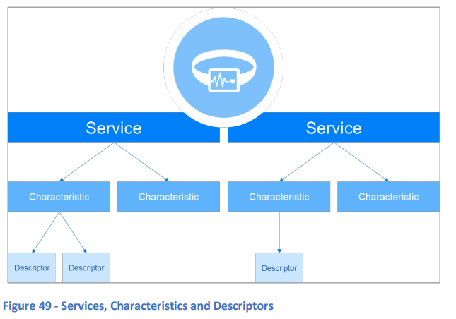
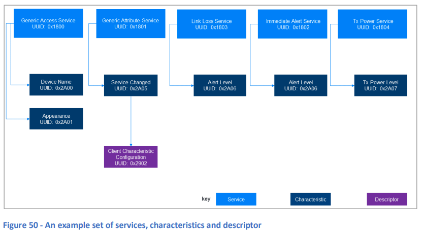
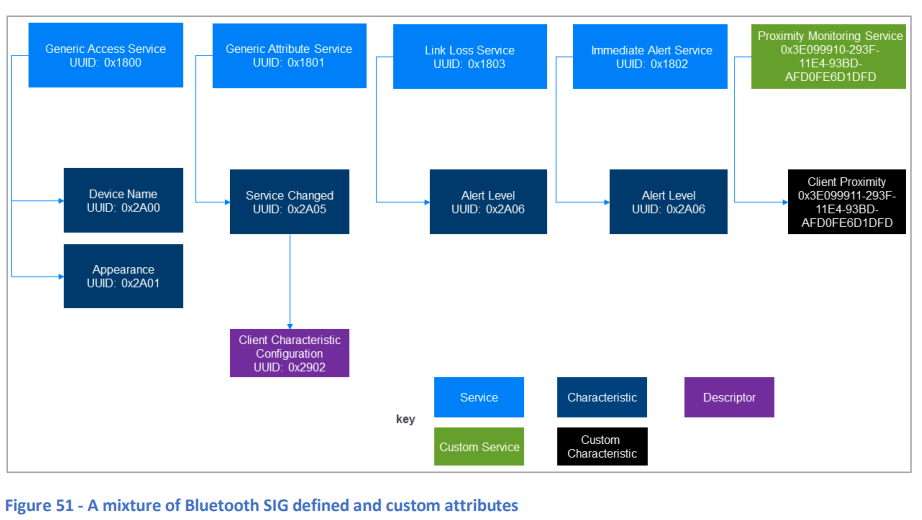

# 12. Generic Attribute Profile (GATT)

## 12.1 基本事項

Generic Attribute Profile (GATT) は、アトリビュートテーブルに保持されるアトリビュートに基づいた高レベルのデータ型を定義します（詳細は「11. アトリビュートプロトコル」を参照）。これらのデータ型は **サービス**、**キャラクタリスティク**、および **ディスクリプタ** と呼ばれます。また、これらのデータ型をアトリビュートプロトコル (ATT) 経由で使用するための一連の手順も定義しています。アプリケーションは通常、これらの手順にマッピングされたプラットフォームAPIを使用します。

- **サービス** は、含まれるキャラクタリスティクを使用するためのコンテキストを提供するグルーピング機構であり、定義された型を持ちます。サービスは、デバイスの主要な機能や特性に対応することが多いです。
- **キャラクタリスティク** は、個々の状態データの項目であり、型、関連する値、および関連するGATT手順のセットに基づくデータの使用方法を示すプロパティを持ちます。たとえば、接続されたピアデバイスは、特定のキャラクタリスティクの値を読み取ることはできても、書き込みはできないと定義される場合があります。
- キャラクタリスティクはサービスに属します。同じキャラクタリスティクの型が複数のサービスのメンバーになることができ、各サービスが提供する異なるコンテキストに基づいてキャラクタリスティクの使用ルールが異なる場合があります。これらの詳細はサービス仕様で提供されます。
- **ディスクリプタ** はキャラクタリスティクに属し、キャラクタリスティクのテキスト説明などのメタデータや、キャラクタリスティクの動作を制御する手段を含むことができます。キャラクタリスティクには、0個以上のディスクリプタが付随します。

たとえば、GATTには、キャラクタリスティク値通知という操作が定義されており、これにはデバイスがATT PDUにキャラクタリスティク値を含め、接続されたピアに非同期で送信し、他のデバイスからの応答を要求しないというものがあります。キャラクタリスティクが通知をサポートしている場合、通知は通常、キャラクタリスティクの値が変化したときや、タイマーによって制御された一定の間隔で送信されます。ただし、通知はピアデバイスが要求した場合にのみ送信されます。この要求は、クライアントキャラクタリスティク設定ディスクリプタと呼ばれる特定のタイプのディスクリプタにフラグを設定することによって行われます。通知をサポートするキャラクタリスティクには、このディスクリプタが必要です。

サービス、キャラクタリスティク、およびディスクリプタの階層構造は、以下の図49に示されています。

  
**図49 - サービス、キャラクタリスティク、およびディスクリプタ**

GATTは2つの役割を定義しています。**GATTクライアント**はATTコマンドと要求をGATTサーバに送信します。**GATTサーバ**は、GATTクライアントから受け取ったコマンドや要求を受け入れ処理し、GATTクライアントにATT通知、インディケーション、応答を送信します。

すべてのGATTサーバには、2つの特別なサービスが必須です。これらは、**Generic Access Service** と **Generic Attribute Service** です。

## 12.2 Bluetooth SIG vs カスタム

一部のサービス、キャラクタリスティク、およびディスクリプタはBluetooth SIGによって定義されており、これらの型を識別する16ビットUUID値を持っています。Bluetooth SIGが定義した各型のリストは [Bluetooth公式サイト](https://www.bluetooth.com/specifications/assigned-numbers) で確認できます。実装者は、[Bluetoothサポートページ](https://support.bluetooth.com/hc/en-us/articles/360062030092-Requesting-Assigned-Numbers) で説明されているように、16ビットUUIDや他の種類の割り当て番号を購入できます。

実装者は、カスタムサービス、キャラクタリスティク、およびディスクリプタを定義することもできます。これらは、実装者が割り当てた128ビットUUID値で識別されるか、またはBluetooth SIGから購入した16ビットUUID値で識別されます。16ビットUUIDは、0000XXXX-0000-1000-8000-00805F9B34FBという形式の128ビット値に対応しており、XXXXは16ビットUUID値を示します。Bluetooth SIGから購入したUUID以外の範囲内でUUIDを使用することはできません。

GATTサーバは、Bluetooth SIGによって定義されたサービス、キャラクタリスティク、およびディスクリプタ（アトリビュート）のみを含む場合もあれば、Bluetooth SIG定義のアトリビュートとカスタムアトリビュートの混在を含む場合もあります。

# 12.3 手順

GATT手順は、サービス探索、キャラクタリスティク探索、ディスクリプタ探索、キャラクタリスティク値の読み書き、キャラクタリスティク値の通知およびインディケーションを含むものが定義されています。GATT仕様は、これらの手順と、それらが使用する必要がある基盤となるATTプロトコルとの明確なマッピングを提供しています。

# 12.4 例

## 12.4.1 Bluetooth SIG定義の属性のみ

図50は、サービスとそのキャラクタリスティクのセットの例を示しています。1つのキャラクタリスティクには関連するディスクリプタがあります。この例の各属性はBluetooth SIGによって定義されています。

  
**図50 - サービス、キャラクタリスティク、ディスクリプタの例**

図に示されているサービスは、標準的なプロキシミティプロファイルを実装したデバイスが持つ可能性のあるもので、イミディエイトアラートおよびTXパワーサービスは必須ではありません。アラートレベルキャラクタリスティクが2回登場していることに注目してください。1つはリンクロスサービス内、もう1つはイミディエイトアラートサービス内です。両方の場合、UUIDは同じです。これがアラートレベルキャラクタリスティクとして識別される理由です。しかし、キャラクタリスティクがグループ化されているサービスは、それぞれ異なるコンテキストを提供しており、アラートレベルキャラクタリスティクに関連するルールや動作は2つのサービス間で異なります。

サービス変更キャラクタリスティクには、クライアントキャラクタリスティク設定ディスクリプタが関連付けられています。これは、キャラクタリスティクが通知をサポートしているためです。通知やインディケーションをサポートするすべてのキャラクタリスティクには、クライアントキャラクタリスティク設定ディスクリプタが必要です。これは、クライアントが書き込みできる値が、現在通知やインディケーションが有効かどうかを制御するためです。

## 12.4.2 Bluetooth SIGとカスタム属性の混在

図51は、Bluetooth SIGによって定義されたGATT属性と、1つのカスタムサービスを含むGATTサーバの例を示しています。このカスタムサービスには、1つのカスタムキャラクタリスティクが含まれています。カスタムサービスは **Proximity Monitoring Service** と呼ばれ、UUID型識別子値は `0x3E099910-293F-11E4-93BD-AFD0FE6D1DFD` です。キャラクタリスティクは **Client Proximity Characteristic** と呼ばれ、UUID値は `0x3E099911-293F-11E4-93BD-AFD0FE6D1DFD` です。このサービスとキャラクタリスティクは、教育開発リソース「An Introduction to Bluetooth Low Energy Development」でプロジェクト作業に使用されています。詳細については、16章「追加リソース」を参照してください。

  
**図51 - Bluetooth SIG定義およびカスタム属性の混合例**
