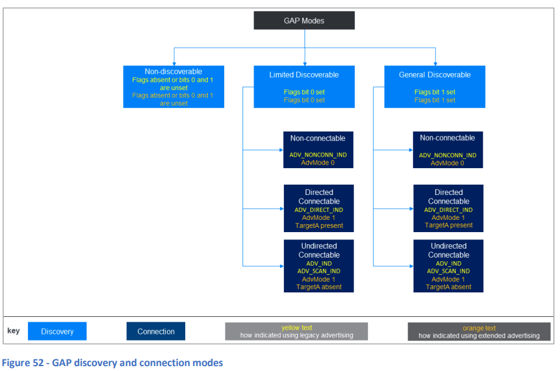

# 13. Generic Access Profile (GAP)

## 13.1 基本事項

Bluetooth Core SpecificationのGeneric Access Profile (GAP)セクションでは、デバイスの発見と2つのデバイス間の接続確立に関する手順が定義されています。一般的なデータの接続なし通信の実行方法、定期的な広告の使用方法（「7.7.3 PADVB - LE定期広告ブロードキャスト」を参照）、および同期通信の設定方法（「7.7.5 LE BISおよびLE CIS - 同期通信」を参照）もGAPのトピックとして含まれています。

さらに、いくつかの重要なユーザーインターフェース標準やBluetooth LEセキュリティの特定の側面も、この仕様書のセクションで取り上げられています。

広告パケットの送信（広告）とスキャンによる受信は、GAPが機能する多くの部分の中核です。さまざまな広告およびスキャンパケットのタイプがあり、これらはリンク層によって定義されています。ペイロードフィールドは**AdvData**と呼ばれ、このフィールドがすべてのPDUタイプに存在するわけではないことに注意してください。存在する場合、そのデータは**ADタイプ**として知られる、1つ以上の長さ/タグ/値構造のシリーズとしてエンコードされます。ADタイプは、[Core Specification Supplement (CSS) ドキュメント](https://www.bluetooth.com/specifications/assigned-numbers)に定義されています。

GAPはBluetooth LEとBluetooth BR/EDRの両方に関連していますが、ここではBluetooth LEに関するGAPのみが取り上げられます。また、広告やスキャンのような活動がGAPにとって中心的な意味を持つ一方で、これらの手順は実際にはリンク層によって実行され、関連するPDUタイプもリンク層によって定義されています。

## 13.2 役割

GAPは4つのデバイスロールを定義しています。これらは以下の表7にリストされ、説明されています。

| **役割**      | **説明**                                                                                                                                             |
|---------------|------------------------------------------------------------------------------------------------------------------------------------------------------|
| **ブロードキャスター** | 広告を使用してデータを接続なしで送信するデバイス。これには従来の広告、拡張広告、定期的な広告が含まれます。ブロードキャスターは、ブロードキャスト同期ストリームも送信できます。送信機を持ち、受信機を持つかどうかはオプションです。ブロードキャスターは、Centralデバイスからの接続を受け付けません（Peripheralの役割も果たす場合を除く）。 |
| **オブザーバー**    | 広告パケットやブロードキャスト同期ストリームデータパケットを受信します。他のデバイスに接続しません。受信機を持ち、送信機を持つかどうかはオプションです。オブザーバーは、接続なしでブロードキャストデータを受信できます。                                              |
| **ペリフェラル**    | Centralデバイスによって接続されることができ、送信機と受信機を持ちます。                                                                                                 |
| **セントラル**      | Peripheralデバイスとの接続確立を開始でき、送信機と受信機の両方を持ちます。                                                                                             |

**表7 - GAPロール**

役割名「Central」および「Peripheral」はリンク層でも使用されますが、これらの2つの異なる文脈での意味は同じではないことに注意してください。

## 13.3 発見

ブロードキャスターまたはペリフェラルデバイスは、非発見モードにいるか、GAPで定義されている2つの発見モードのいずれかにいます。非発見モードで広告を行う場合、送信されたパケットは無線で確認可能ですが（これはセキュリティ機能ではありません）、General Discoverable手順またはLimited Discoverable手順を実行しているスキャンデバイスはこれらのパケットを無視します。

発見可能なデバイスは、一般的な発見モードまたは制限付き発見モードのいずれかにいます。一般的な発見モードでは、デバイスは無期限に発見可能ですが、制限付き発見モードでは最大3分間だけ発見可能です。発見中のデバイスは、AdvDataフィールド内の**Flags**と呼ばれるADタイプを調べることで、広告デバイスがどの発見モードにあるかを認識できます。制限付き発見モードは、ユーザーが最近操作したデバイスに優先順位を与えるために使用されることが多く、ボタンを押したり、デバイスを持ち上げたりして起動する場合があります。

CentralまたはObserverデバイスが他のデバイスを発見しようとすると、**パッシブスキャン**または**アクティブスキャン**のいずれかを使用することができます。どちらが許可されるかは、デバイスが一般的な発見モードか制限付き発見モードでデバイスを発見しようとしているかに依存します。

- **パッシブスキャン**は、スキャンPDUsを送信せずに広告PDUsを受信することを指します。
- **アクティブスキャン**は、広告PDUsを受信し、スキャンPDUsを送信して応答としてさらに情報を要求することを指します。

さまざまなPDUタイプはリンク層によって定義されており、7.7.2 ADVB - LE Advertising Broadcastでまとめられています。

Bluetooth Core Specificationでは、デバイスによっては従来の広告のみを使用する場合もあれば、拡張広告を使用したり、両方の広告形式を組み合わせたりする場合があると述べられています。デバイスが発見手順のいずれかを実行する際は、両方の広告タイプに対してスキャンを組み合わせることが推奨されます。また、デバイスはサポートするすべてのPHYでスキャンすることが推奨されます。

図52は、他の関連する変数とともにGAPの発見モードを示しています。

## 13.4 接続モード

広告を行っているデバイスは、PDU（従来の広告）またはAdvModeフィールドの値（拡張広告）によって、接続可能かどうかを示すことができます。

図52は、他の関連する変数とともにGAPの接続モードを示しています。

デバイスは、GAPで定義されている接続に関連する手順のいずれかを実行して、別のデバイスとの接続を要求することができます。これは通常、受信したPDUに対する応答として、CONNECT_IND PDU（従来の広告）またはAUX_CONNEXT_REQ PDU（拡張広告）を送信することが含まれます。リンク層では、広告および接続要求のPDUタイプが定義されており、接続要求を送信できるPDUタイプに関するルールも定められています。詳細は「7.7.2.2.3 Legacy Advertising and Associated PDU Types」および「7.7.2.3.5 Extended Advertising and Associated PDU Types」を参照してください。

## 13.5 指定広告 vs 非指定広告

GAPで使用される広告は、**非指定広告**（PDUsが受信したすべてのObserverまたはCentralデバイスに適用される）または**指定広告**（特定のデバイスだけがPDUsを処理するべきもの）のいずれかです。指定広告に関わるPDUsには、対象デバイスのBluetoothアドレスが含まれる**TargetAフィールド**があります。一方、非指定広告では、TargetAフィールドは存在しません。

図52は、GAPの発見および接続モードにおける指定広告と非指定広告を示しています。

  

なお、AD Type Flagsは、従来の広告パケットがプライマリ広告チャネルで受信された場合に表示されます。一方、拡張広告が使用されている場合、プライマリチャネルで受信されたADV_EXT_IND PDUにはAdvDataフィールドが存在しません。拡張広告でFlagsを使用する場合は、一般目的チャネルのAUX_EXT_IND PDUで表示されます。

## 13.6 スキャン可能 vs 非スキャン可能

特定の広告PDUタイプは、**スキャン可能**とされています。これは、デバイスがそのようなPDUを受信した場合、適切なタイプのスキャンリクエストPDUを送信し、さらに広告データを要求することが許可されることを意味します。広告PDUはリンク層によって定義されています。詳細については、「7.7.2.2.3 従来の広告と関連PDUタイプ」および「7.7.2.3.5 拡張広告と関連PDUタイプ」を参照してください。

## 13.7 GAPとLEセキュリティ

GAP仕様では、いくつかのセキュリティ用語、モード、および手順が定義されています。一般的に、GAPのセキュリティ手順は、セキュリティマネージャープロトコル（SMP）やリンク層など、スタックの他のレイヤーを含みますが、これらのレイヤーを使用して特定の結果を達成するための高レベルの手順は、Bluetooth Core SpecificationのVolume 3 Part C（Generic Access Profile）に定義されています。詳細については、この仕様書を参照してください。

## 13.8 定期広告

定期広告はリンク層によって実行されます（「7.7.3 PADVB - LE定期広告ブロードキャスト」を参照）が、GAPでは、ブロードキャスターが定期広告モードに入る手順や、オブザーバーが定期広告トレインに同期するための手順を指定しています。さらに、**定期広告同期転送 (PAST)** 手順もGAPで定義されており、オブザーバーがブロードキャスターから定期広告同期パラメーターを取得し、それをACL接続を介して別のデバイスに転送することができます。

## 13.9 同期ブロードキャスト

ブロードキャスト同期ストリームや接続型同期ストリームを使用した同期通信はリンク層によって実行されます（「7.7.5 LE BISおよびLE CIS - 同期通信」を参照）が、GAPでは、この形式の通信に関わるブロードキャスターおよびオブザーバーが従うべき手順を指定しています。
