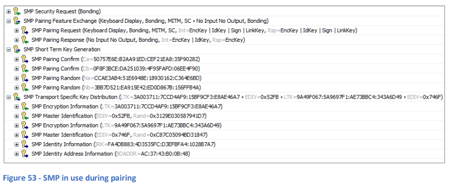

# 14. セキュリティマネージャープロトコル(SMP)

## 14.1 基本事項

セキュリティマネージャープロトコル (SMP) は、Bluetoothスタックのセキュリティマネージャーコンポーネントの一部です。SMPは、**ペアリング**、**ボンディング**、および**キー配布**といったセキュリティ関連の手順の実行をサポートします。

セキュリティマネージャーコンポーネントは、他のレイヤーが使用できるセキュリティ機能向けの暗号ツールボックスを提供し、ペアリングアルゴリズムを定義します。

Bluetooth LEのセキュリティに関する詳細は、セクション15「Bluetooth LEにおけるセキュリティ」で説明されています。

## 14.2 例

**図53**は、2つのデバイスのペアリング中にSMPが使用されている様子を示しています。SMPペアリング機能交換中に、**入出力機能**やその他のフラグの交換が行われていることに注目してください。このステップは、どのペアリングアルゴリズムが選択されるか、および認証などの手順がどのように組み込まれるかを決定する重要なステップです。

  
**図53 - ペアリング中に使用されるSMP**
