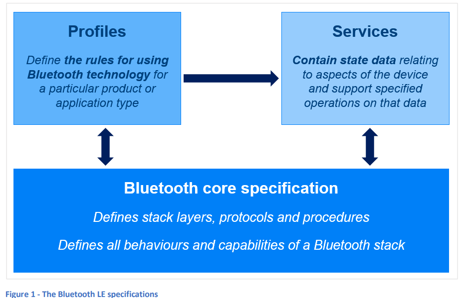

### 4. Bluetooth LEの仕様

Bluetooth LEを深く理解するためには、関連する仕様に精通する必要があります。Bluetooth LEのアーキテクチャ、手順、およびプロトコルは、**Bluetooth Core Specification**と呼ばれる主要な仕様によって完全に定義されています。Bluetoothがどのように製品で使用され、相互運用性が確保されるかは、**プロファイル**および**サービス**として知られる2つの特別なタイプの仕様によってカバーされています。図1は、Bluetooth LE仕様のタイプとその関係を示しています。

  

#### 4.1 Bluetoothコア仕様

**Bluetooth Core Specification**は、Bluetooth LEとBluetooth Classicの両方に共通する主要な仕様です。この仕様は、技術のアーキテクチャとそのレイヤーを定義し、重要な機能や手順、スタックの特定のレイヤーでデバイス間の通信をサポートするプロトコルを説明します。そのため、この仕様は大規模なものとなっています。  
Bluetooth Core Specificationは、Bluetooth技術がどのように機能するか、Bluetoothスタックやその機能の1つまたは複数を実装する際に開発者が満たすべき要件を定義します。

#### 4.2 プロファイル仕様

2つのBluetooth LEデバイスが接続を介して通信する場合、多くの場合クライアント/サーバー関係が形成されます。サーバーは状態データを保持し、クライアントはそのデータを使用します。  
例えば、Bluetoothキーフォブ（鍵を見つけるためのデバイス）を考えてみましょう。このキーフォブは、置き忘れた鍵を見つけることを目的としています。スマートウォッチがクライアントデバイスとして機能し、Bluetoothキーフォブがサーバーとして機能します。スマートウォッチのディスプレイ上のボタンを押すと、キーフォブの状態が変化し、その変化に応じて大きな音を鳴らすことで鍵を見つけられるようになります。  
**プロファイル仕様**は、このような関連デバイス（例: スマートウォッチとキーフォブ）が取る役割を定義し、特にクライアントデバイスの動作や、接続されたサーバー上のデータに対してどのように操作するかを定義します。  
この鍵探しの例では、スマートウォッチまたは同様の役割を果たすデバイスの動作は、**Find Me Profile**仕様に定義されています。

#### 4.3 サービス仕様

サーバー上の状態データは、正式に定義されたデータ項目である**キャラクタリスティック**および**ディスクリプタ**の形式で保存されます【2】。キャラクタリスティックとディスクリプタは、**サービス**と呼ばれる構造の中にグループ化されています。サービスは、キャラクタリスティックとディスクリプタに意味と動作を割り当てるためのコンテキストを提供します。  
**サービス仕様**は、1つのサービスとその中に含まれるキャラクタリスティックおよびディスクリプタを定義します。また、デバイスがさまざまな条件や状態データ値に応じてどのような動作を行うかも定義されています。  
サービス仕様は、サーバーデバイスの動作の1つの側面を定義していると考えることができます。  
先ほどのスマートウォッチとキーフォブの例では、キーフォブがサーバーとして機能し、**Immediate Alert Service**を実装しています。

#### 4.4 割り当てられた番号

Bluetooth LEのさまざまな要素には、一意の識別子が使用されます。例えば、すべてのサービス、キャラクタリスティック、およびディスクリプタには、ユニバーサルユニーク識別子（UUID）があり、そのUUIDは特定のデバイスではなく、関連するサービス、キャラクタリスティック、またはディスクリプタのタイプを識別します。また、特定のプロファイルには、企業識別子も使用されます。  
Bluetooth SIGによって割り当てられた識別子は「割り当てられた番号」として知られており、その完全なリストはBluetooth SIGのウェブサイトにある**Assigned Numbers**ページで入手できます。

---

【2】サービス、キャラクタリスティック、ディスクリプタは、**Generic Attribute Profile**セクションで説明されます。

このセクションの翻訳が完了しました。引き続き翻訳したい部分があればお知らせください。