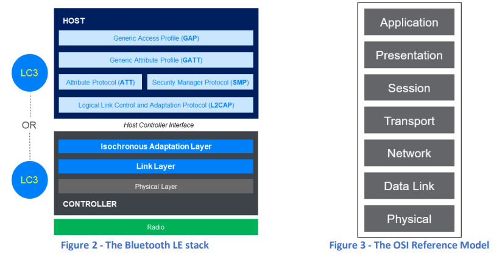
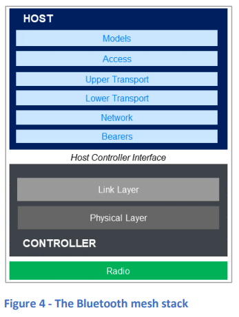

### 5. Bluetooth LEスタック

#### 5.1 高レベルアーキテクチャ

Bluetooth LEスタックは、いくつかのレイヤーと機能モジュールで構成されており、その一部は必須で、他の一部はオプションです。これらのスタックの構成要素は、**ホスト**と**コントローラ**と呼ばれる2つの主要なアーキテクチャブロックに分かれ、これらの2つのコンポーネントが通信するための標準的な論理インターフェースが定義されています。

ホストは、しばしばオペレーティングシステムのような役割を果たし、コントローラはシステム・オン・チップ（SoC）として機能することが多いです。ただし、Bluetooth仕様では、これらの実装に関する詳細は強制されておらず、ホストとコントローラが論理的に分離されたコンテナとして機能し、これらが物理的に別のコンポーネントとして実装される可能性があることが重要です。このような設計により、Bluetoothシステムは異なるメーカーのホストとコントローラコンポーネントで構成されることが可能となっています。

図2は、Bluetooth LEスタックのレイヤーと、それらがホストとコントローラのコンポーネントにどのように分布しているかを示しています。**ホストコントローラインターフェース (HCI)** は両者間の論理的なインターフェースを示しますが、物理的なコンポーネントではありません。HCIは、物理トランスポートの基盤となる実装は異なる場合がありますが、論理的または機能的なインターフェースは常に同じです。

**LC3** は、Bluetooth LE Audioで使用されるデフォルトのオーディオコーデックであり、Low Complexity Communication Codecの略です。これは標準的なBluetooth LEスタックの一部ではありませんが、LE Audio製品には常に含まれており、LC3コンポーネントはホストまたはコントローラのいずれかに実装されます（図を参照）。

図3は、通信システムの標準的なOSI参照モデルを示しています。Bluetooth LEスタックは、他の多くのワイヤレスシステムが物理層やデータリンク層のサブセットのみをカバーしているのに対し、OSI参照モデルのすべての層をカバーしています。このようにBluetooth技術がフルスタック通信システムであることの利点の1つは、他の標準化団体に依存しないことです。こうした依存は、技術の進化を制約する可能性があります。

  

**Bluetoothメッシュ**は、リンク層および物理層を持つBluetooth LEコントローラを使用し、ホスト部分にはBluetoothメッシュプロトコルと手順を実装するための別のレイヤーのコレクションが含まれています。本書ではBluetoothメッシュについてはこれ以上詳しく扱いません。メッシュに関する教育リソースを探している方は、セクション16「追加リソース」を参照してください。

  

#### 5.2 レイヤーの概要

図2に示されているBluetooth LEスタックの各レイヤーの主な責任と特徴は以下の通りです：

| **レイヤー** | **主な責任** |
| --- | --- |
| **物理層** | 無線（RF）に関連するBluetooth技術のすべての側面を定義。変調方式、周波数帯域、チャネル使用、送信機と受信機の特性など。 複数の異なる物理層パラメータの組み合わせ（PHYs）が定義されている。 |
| **リンク層** | 空中インターフェースのパケット形式、ビットストリーム処理手順（エラーチェックなど）、状態マシン、無線通信およびリンク制御のプロトコルを定義。 接続レス、接続指向、およびアイソクロナス通信のためのいくつかの異なる論理トランスポートが定義されている。 |
| **アイソクロナス適応層 (ISOAL)** | アイソクロナス通信を使用するデバイス間で異なるフレーム継続時間を使用できるようにする。 フレーム化されたPDUのセグメンテーションと再構成、またはフレーム化されていないPDUの断片化と再結合を実行。 |
| **ホストコントローラインターフェース (HCI)** | ホストコンポーネントとコントローラ間でコマンドおよびデータを双方向に通信するための明確に定義された機能的インターフェースを提供。 複数の物理トランスポート実装に対応。 |
| **論理リンク制御および適応プロトコル (L2CAP)** | ホスト内でプロトコルのマルチプレクサとして機能し、適切なホストコンポーネントにプロトコルをサービスする。 L2CAPの上下のレイヤー間でPDU/SDUのセグメンテーションおよび再組み立てを実行。 |
| **セキュリティマネージャープロトコル (SMP)** | ペアリングなどのセキュリティ手順を実行するために使用されるプロトコル。 |
| **属性プロトコル (ATT)** | ATTクライアントとATTサーバーがサーバーの属性テーブル内のデータを発見し利用するためのプロトコル。 |
| **一般属性プロファイル (GATT)** | サービス、キャラクタリスティック、ディスクリプタとして知られる高レベルのデータ型を、属性テーブル内の基本的な属性として定義。 ATTを使用して属性テーブルを操作するための上位レベルの手順を定義。 |
| **一般アクセスプロファイル (GAP)** | 接続されていない状態で使用される運用モードおよび手順（例: 接続レス通信のためにアドバタイジングを使用する方法、デバイス検出を行う方法）を定義。 セキュリティレベルとモードを定義。 一部のユーザーインターフェース基準を定義。 |

これから、図2に示されている各Bluetooth LEスタックのレイヤーをさらに詳しく見ていきます。