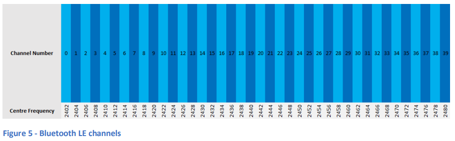
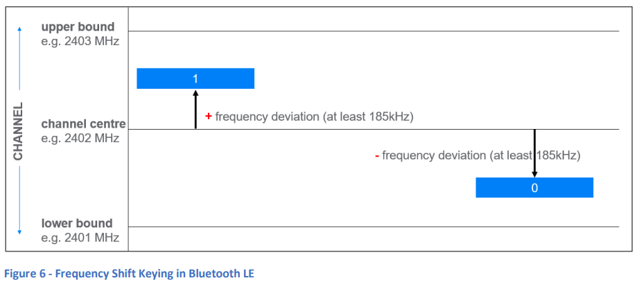

### 6. 物理層

Bluetooth LEの物理層は、無線送信機/受信機がデジタルデータをエンコードして送信し、受信したデータをデコードする方法、および無線に関連するその他のパラメータや特性を定義しています。

#### 6.1 周波数帯域

Bluetooth LEは、2400 MHzから2483.5 MHzの範囲にある2.4GHzの免許不要帯域で動作し、40のチャネルに分割されています。各チャネルの間隔は2 MHzです。チャネルの使用方法はリンク層とデータ伝送アーキテクチャによって定義されます。  

#### 6.2 変調方式

Bluetooth LEは、送信前にスタックの上位レイヤーからのデジタルデータをエンコードし、受信した無線信号をデコードするために、**ガウシアン周波数シフトキーイング (GFSK)** と呼ばれる変調方式を使用します。GFSKは、選択されたチャネルの中央周波数（キャリア）を基準に、デジタル値1を表すために指定された量だけ周波数を上げたり、デジタル値0を表すために同じ量だけ周波数を下げたりする方式です。周波数の急激な変化に伴うノイズを減らすために、信号にはガウシアンフィルタリングが適用されます。

#### 6.3 PHYのバリアント

Bluetooth LEには、3つの異なる変調方式のバリアントが定義されています。それぞれのバリアントは**PHY**と呼ばれ、名前が付けられています。物理層での伝送速度は、ビット毎秒ではなくシンボル毎秒で測定されます。Bluetooth LEは2進数変調方式を使用しているため、1つのアナログシンボルがスタックの上位にある1つのデジタルビットを表します。

3つのPHYタイプの概要は次のとおりです：

- **LE 1M PHY**: 1 Msym/sのシンボルレートを使用し、最低185 kHzの周波数偏差が必要です。特別なコーディングは使用しません。すべてのデバイスがLE 1M PHYをサポートする必要があります。
- **LE 2M PHY**: LE 1M PHYに似ていますが、シンボルレートは2 Msym/sであり、最低370 kHzの周波数偏差が必要です。LE 2M PHYのサポートはオプションです。
- **LE Coded PHY**: 1 Msym/sのシンボルレートを使用しますが、リンク層で定義された前方誤り訂正（FEC）が適用されます。FECは伝送範囲を拡大しますが、アプリケーションデータの速度を低下させます。LE Coded PHYのサポートもオプションです。

各PHYの比較は以下の通りです：

| PHYタイプ       | シンボルレート | プロトコルデータ速度 | 最大アプリケーションデータ速度 | 誤り検出 | 誤り訂正 | 範囲乗数 | 必須性 |
| --------------- | -------------- | -------------------- | ----------------------------- | -------- | -------- | -------- | ------ |
| LE 1M           | 1 Ms/s         | 1 Mbit/s              | 800 kbps                      | CRC      | なし     | 1        | 必須   |
| LE Coded (S=2)  | 1 Ms/s         | 500 Kbit/s            | 400 kbps                      | CRC      | FEC      | 2        | オプション |
| LE Coded (S=8)  | 1 Ms/s         | 125 Kbit/s            | 100 kbps                      | CRC      | FEC      | 4        | オプション |
| LE 2M           | 2 Ms/s         | 2 Mbit/s              | 1400 kbps                     | CRC      | なし     | 0.8      | オプション |

#### 定義

- **シンボルレート**: 物理層においてアナログシンボルが送信される速度。
- **プロトコルデータ速度**: Bluetoothプロトコルデータユニット (PDU) に関連するビットの伝送速度。アプリケーションデータのペイロードを含みますが、LE Coded PHYを使用している場合、パケットに含まれる前方誤り訂正 (FEC) データは除きます。
- **最大アプリケーションデータ速度 (概算)**: 接続されたデバイス間でアプリケーションデータが通信されるおおよその最大速度。アプリケーションデータは、さまざまなPDUのペイロード部分で伝送されますが、残りのプロトコルデータ速度はBluetoothプロトコルデータに使用されます。
- **CRC (循環冗長検査)**: 伝送エラーを検出するために使用されるフィールド。このフィールドおよびその使用方法は、リンク層で定義されています。

#### 6.4 時分割

Bluetooth LEの無線は半二重デバイスであり、送信または受信が可能ですが、同時に行うことはできません。しかし、すべてのPHYは**時分割複信 (TDD)** 方式を使用しているため、あたかも全二重無線のように見せかけることができます。

#### 6.5 送信電力と受信感度

物理層は送信機の出力特性を定義しており、次のように仕様で規定されています：

- 最大出力設定時の出力電力レベルは0.01 mW（-20 dBm）から100 mW（+20 dBm）の間でなければならない。

各国の規制当局はこれらの要件を上書きする場合があり、実装者はデバイスが適用されるローカル規制に準拠していることを確認する必要があります。

受信感度は、特定のビット誤り率 (BER) を経験する際の受信機入力レベルとして定義されます。BERは、リンク層が各パケットに追加する**循環冗長検査 (CRC)** フィールドによって測定され、パケットの長さに依存します。通常、Bluetooth LEの受信感度に関して言及されるのは、最大37オクテットのパケットに対する0.1%のBERです。

#### 6.6 アンテナスイッチング

Bluetooth LEは、受信信号の送信方向を計算するために、**到着角 (AoA)** と**出発角 (AoD)** という2つの方法をサポートしています。どちらの方法も、複数のアンテナを持つデバイスが関与し、送信中（AoD方式）または受信中（AoA方式）に方向検出信号を送受信する際にアンテナを切り替えます。方向検出信号は、**一定トーン拡張 (CTE)** フィールドを含む標準的なBluetoothパケットです。

アンテナ配列の設計やスイッチングのパターンは多岐にわたり、ホストによって制御されますが、物理層はアンテナスイッチングのプロセスに関する一般的なルールも定義しています。

Bluetooth Core SpecificationのVolume 6, Part A, Section 5で、さらに詳細な説明が行われており、Bluetooth Core Specificationバージョン5.1 Feature Overview paperでも、AoAとAoDに関する情報が提供されています。