### 7. リンク層

#### 7.1 リンク層の概要

リンク層の仕様は、Bluetooth Core SpecificationのBluetooth LEセクションの中で、ホストコントローラインターフェース機能仕様に次いで2番目に大きい部分です。しかし、おそらく最も複雑です。  
リンク層には多くの責任があります。空中で送信される複数の種類のパケットと、それに関連する空中インターフェースプロトコルを定義しています。また、リンク層の動作は、明確に定義された状態マシンに従っています。この状態に応じて、リンク層はさまざまな動作を行い、複数の種類のイベントに応じて動作が変わります。リンクの状態やリンクの使用パラメータに影響を与える多数の制御手順が定義されています。無線チャネルの選択や分類もリンク層仕様で定義されています。

リンク層は、接続型通信と接続レス通信の両方、そして決定論的および（若干の）ランダム化されたイベントタイミングをサポートします。また、2つのデバイス間のポイントツーポイント通信と、1つのデバイスから無制限の数の受信デバイスへの1対多通信の両方をサポートします。

Bluetooth LEの多くの柔軟性は、リンク層の高度な機能に根ざしています。

#### 7.2 パケット

リンク層では、2つのパケットタイプが定義されています。1つは、LE 1MおよびLE 2Mの**未符号化PHY**に使用されるパケット（図7参照）、もう1つは、**LE Coded PHY**に使用されるパケットです（図8参照）。  

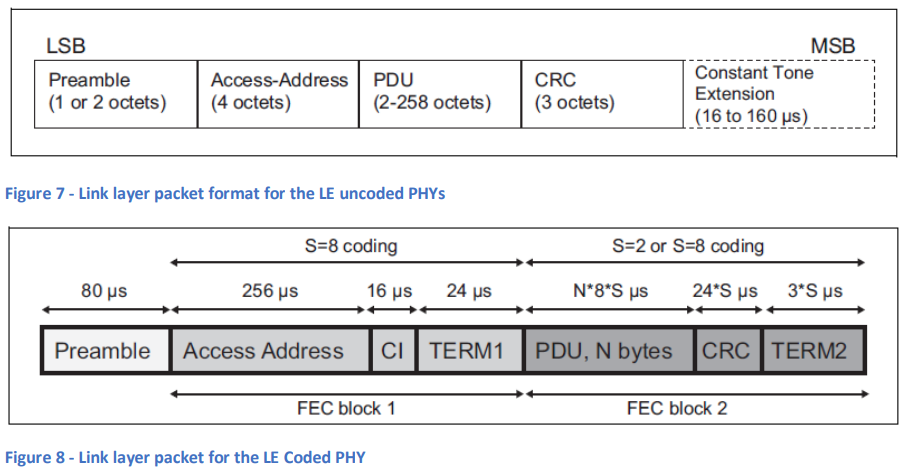  

リンク層の両方のパケットタイプには、共通のフィールドとして**プレアンブル**、**アクセスアドレス**、および**CRC**が含まれています。以下の表1は、これらの共通フィールドを説明します。

| **リンク層パケットフィールド名** | **説明** |
| ---------------------------------- | -------- |
| **プレアンブル** | 受信機が信号の周波数に正確に同期し、自動利得制御を行い、シンボルタイミングを推定するために使用されます。 |
| **アクセスアドレス** | アクセスアドレスは、受信機がバックグラウンドノイズと信号を区別し、そのパケットが受信デバイスに関連するかどうかを判断するために使用されます。たとえば、接続されたデバイスのペアは、同じランダムに割り当てられたアクセスアドレスを使用してパケットを交換します。接続に参加していないデバイスは、そのアクセスアドレスが自分に関連しないため、これらのパケットを無視します。同様に、すべてのレガシーアドバタイジングパケットは、0x8E89BED6の値を持つ同じアクセスアドレスを使用しており、これにより、これらのパケットはすべてのデバイスで受信可能であることが示されます。 |
| **CRC (循環冗長検査)** | CRCはエラー検出に使用されます。送信側は、パケット内の他のビットの値を使用してCRC値を計算します。受信側は、受信したパケットのCRCフィールドを除いたビットの値からCRC値を計算し、パケット内のCRCフィールドの値と比較します。CRC値が一致すれば、そのパケットは正しく受信されたと判断されます。そうでない場合は、1つ以上のビットにエラーがあると見なされます。 |

**表1 - 共通のリンク層パケットフィールド**

リンク層パケットのPDUフィールドには、Bluetooth LEの使用方法に応じてさまざまな**プロトコルデータユニット (PDU)** が含まれます。また、方向検出法（**到着角 (AoA)** または**出発角 (AoD)**）が使用されている場合には、**一定トーン拡張 (CTE)** が存在します。

PDUとCRCフィールドは、パケット送信前に**ホワイトニング**と呼ばれるプロセスにかけられます。ホワイトニングの目的は、パケット内で長いゼロや1の連続を避けることで、受信機の周波数ロックのドリフトを防ぐことです。ホワイトニングプロセスは、受信機によって逆処理され、元のビットストリームが復元され、CRCのチェックが行われます。

PDUフィールドは、暗号化される場合があり、その際はメッセージインテグリティチェック (MIC) フィールドが含まれ、PDUが改ざんされていないことを保護します【3】。

LE Coded PHYが使用されている場合、ビットストリームは送信前に追加の処理が行われます。**前方誤り訂正 (FEC)** エンコーダを適用した後、**パターンマッパー**がデータを生成し、受信機がこれらのプロセスを逆に適用し、可能であればエラービットを修正します。

### 7.3 状態マシン

リンク層は状態マシンによって制御されており、図9にその状態マシンが示されています。  

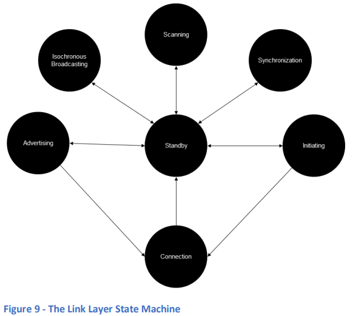  

各状態の詳細は、リンク層の仕様書を参照してください。以下に概要を表2に示します。一部の用語はこのセクションの後で説明されます。

| **状態**             | **説明**                                                                 |
| ------------------- | ------------------------------------------------------------------------ |
| **待機 (Standby)**    | デバイスがパケットを送受信していない状態。                                           |
| **開始 (Initiating)** | 特定のデバイスからのアドバタイジングパケットに応答して、接続を要求する状態。               |
| **アドバタイジング (Advertising)** | アドバタイジングパケットを送信し、他のデバイスからの応答パケットを処理する場合もある状態。        |
| **接続 (Connection)** | 他のデバイスとの接続状態。                                                        |
| **スキャン (Scanning)** | 他のデバイスからのアドバタイジングパケットをリスニングする状態。                            |
| **アイソクロナスブロードキャスト (Isochronous Broadcast)** | アイソクロナスデータパケットをブロードキャストする状態。                             |
| **同期 (Synchronization)** | 特定のデバイスが送信する定期アドバタイジングに属するパケットをリスニングする状態。                |

**表2 - リンク層の状態**

接続状態にある場合、2つの重要なデバイスロールが定義されています。それは**セントラルロール**と**ペリフェラルロール**です。接続を開始して「開始」状態から「接続」状態に移行したデバイスは、セントラルロールを引き受けます。一方、接続要求を受け入れて「アドバタイジング」状態から「接続」状態に移行したデバイスは、ペリフェラルロールを引き受けます。

例えば、音楽プレーヤーアプリを搭載したスマートフォンとポータブルBluetooth LEスピーカーの場合を考えてみましょう。通常、スマートフォンはセントラルロールを引き受け、スピーカーはペリフェラルロールを引き受けます。スマートフォンは、スキャンによってスピーカーのアドバタイジングパケットを発見し、ユーザーの操作を介して接続を開始します。接続が確立されると、関連するLE Audio仕様に定義された追加手順に従い、オーディオストリームが確立されます。

状態マシンのインスタンスは、1度に1つの状態にしかなれません。リンク層の実装は、複数の状態マシンインスタンスを同時にサポートすることができます。  
ただし、すべての役割と状態の組み合わせが許可されているわけではありません。詳細はBluetooth Core Specificationに記載されています。

### 7.4 チャネル選択

セクション6.1「周波数帯域」で説明されているように、Bluetooth LEは2.4 GHz帯域を40のチャネルに分割しています。リンク層はこれらのチャネルの使用方法を制御しており、これはBluetooth LEの通信方式（より正式には現在の物理チャネル）に依存します。物理チャネルについては、セクション7.5「データ転送アーキテクチャ」で詳述します。

Bluetooth LEは、時の経過に伴い複数のチャネルを介してデータを通信するために、さまざまな拡散スペクトル技術を使用しています。これにより、衝突の可能性が減少し、通信がより信頼性の高いものになります。

Bluetooth LEで使用されるよく知られた拡散スペクトル技術の一例として、**適応周波数ホッピング (AFH)** があります。これは、パケット通信に使用される無線チャネルが定期的に変更される方式です。チャネルは、**チャネル選択アルゴリズム**と**チャネルマップ**と呼ばれるデータテーブルを使用して選択されます。このチャネルマップは、各チャネルを使用中または未使用として分類します。

実装は、各チャネルの通信品質を監視することができ、他のソースからの干渉などでチャネルのパフォーマンスが悪いことが判明した場合、そのチャネルはチャネルマップで未使用として分類され、アルゴリズムによってそのチャネルが選択されないようにします。このようにして、チャネル選択アルゴリズムは状況に適応し、最も信頼性の高いパフォーマンスを実現するように最適化されます。

無線チャネルの使用方法については、Bluetooth LEの論理トランスポートとそれに関連する物理チャネルを説明する際にさらに詳しく説明されます。

### 7.5 データ転送アーキテクチャ

Bluetooth Core Specificationのアーキテクチャセクションでは、Bluetoothのデータ転送アーキテクチャを構成するいくつかの概念が定義されています。これらの主要な概念には、**物理チャネル**、**物理リンク**、**論理リンク**、および**論理トランスポート**が含まれます。これらは、異なるアプリケーションタイプをサポートするために使用され、それぞれがトポロジー、タイミング、信頼性、チャネル使用などの要件に応じて特定の組み合わせが定義されています。

**物理チャネル**は、Bluetoothを使用して通信するためのいくつかの異なる方法の1つを定義します。例えば、2つの接続されたデバイス間で通信を行う場合、37チャネルにわたって適応周波数ホッピングを行う**LEピコネット物理チャネル**が使用されます。これに対して、**LEアドバタイジング物理チャネル**は、1つのデバイスから無制限の数の他のデバイスへの接続レスのブロードキャスト通信に使用されます。また、**LE定期物理チャネル**もデータのブロードキャストに使用されますが、これは一定の時間スケジュールに基づいて定期的に行われます。オブザーバー（受信）デバイスはこの時間スケジュールを把握し、自身のスキャンスケジュールを同期させることができます。

**物理リンク**は、特定の物理チャネルに基づいており、そのリンクに関する特定の特性（例えば、電力制御の使用の有無など）を指定します。

**論理リンク**と**論理トランスポート**には、特定の物理リンクおよび物理チャネルタイプを使用して、特定のデータ通信要件をサポートするために設計されたさまざまなパラメータがあります。

例えば、Bluetooth LEにおける信頼性の高い双方向のポイントツーポイント通信は、**LE非同期接続指向論理トランスポート (ACL)** を使用し、制御データには**LE-Cリンク**、ユーザーデータには**LE-Uリンク**を用いて、LEピコネット物理チャネルに基づいた物理リンク上で通信します。

一方、Bluetooth LEにおける信頼性の低い一方向ブロードキャスト通信は、**LEアドバタイジングブロードキャスト (ADVB)** 論理トランスポートを使用し、制御データには**ADVB-Cリンク**、ユーザーデータには**ADVB-Uリンク**を用いて、LEアドバタイジング物理チャネルに基づいた物理リンク上で通信します。

### 7.6 論理トランスポート

#### 7.6.1 LE ACL - LE非同期接続指向論理トランスポート

##### 7.6.1.1 基本事項

2つのBluetooth LEデバイスが接続されると、**非同期接続指向論理トランスポート (LE-ACL)** を使用しています。LE-ACLは、最も一般的に使用されるBluetooth LE論理トランスポートタイプの1つで、接続指向のデータ通信を提供します。実際、ACL接続は通常「接続」として単に言及されます。

デバイスは、受信したアドバタイジングパケットに接続を要求するPDUで応答することにより、アドバタイジングデバイスとの接続を確立できます。この要求には、いくつかのパラメータが指定されます。これらのパラメータには、アクセスアドレス、接続間隔、ペリフェラル遅延、監視タイムアウト、チャネルマップが含まれます。

接続を要求するデバイスは、**待機**状態から**開始**状態に移行し、次に**接続**状態に入り、**セントラル**の役割を引き受けます。もう一方のデバイスは、**アドバタイジング**状態から**接続**状態に移行し、**ペリフェラル**の役割を引き受けます。

**接続間隔パラメータ**は、この接続を処理するために無線が使用される頻度をミリ秒単位で定義します。接続間隔が終了するたびに、接続イベントが開始され、セントラルデバイスがパケットを送信できます。接続イベントには、16ビットの識別子があり、各イベントでカウンター値が増加します。接続イベントの開始時には、使用する無線チャネルがチャネル選択アルゴリズムを使用して選ばれます。

**監視タイムアウトパラメータ**は、リンクが失われたと見なされるまでに受信されるべきリンク層データパケット間の最大経過時間を指定します。

ペリフェラルデバイスは、セントラルデバイスと同じ接続パラメータに基づいて、セントラルデバイスから送信されるパケットをいつ、どのチャネルで期待すべきかを把握しており、正確なタイミングでそのチャネルをリッスンし、セントラルからのパケットを受信します。ペリフェラルは、セントラルのパケットの最後のビットを受信してから150マイクロ秒後（+/- 2µs）にセントラルデバイスに応答することができます。セントラルとペリフェラルは交互にパケットを送受信し、接続イベント中に定義された数のパケットを交換することができます。ただし、ペリフェラルの動作は、ペリフェラル遅延パラメータがゼロ以外の値である場合に変更されることがあります。

図10は、2つの接続イベント中における基本的なパケット交換を示しており、**C>P** はセントラルデバイスによるパケット送信を、**P>C** はペリフェラルによるパケット送信を示します。

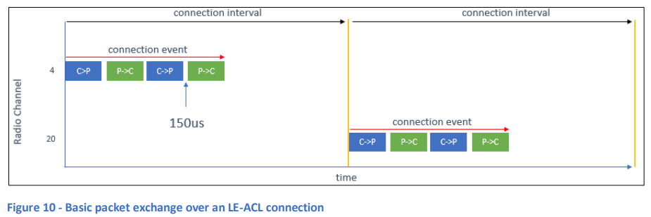  

パケットには、LLデータPDUまたはリンク層制御手順に関連するLL制御PDUが含まれます。

##### 7.6.1.2 順序と確認応答

LE-ACLには、データが正しい順序で処理されることを保証し、パケットの受領を確認し、その結果に基づいて次のパケットに進むか、前のパケットを再送するかを決定するシステムが組み込まれています。

データパケットには、通信の信頼性を確保するための3つの重要なフィールドが含まれています。これらのフィールドは、**シーケンス番号 (SN)**、**次に期待されるシーケンス番号 (NESN)**、および**More Dataフィールド**と呼ばれます。これらのフィールドはすべて1ビットフィールドであり、確認応答のシステムと、受信パケットの正しい順序を確認する方法を提供します。

通信は、主デバイス（デバイスA）がシーケンス番号と次に期待されるシーケンス番号の両方をゼロに設定したリンク層データパケットを送信することから始まります。この後、パケット交換が行われるたびに、問題がなければ、デバイスAによって設定されたSNフィールドの値はゼロと1の間で交互に変化します。補助デバイス（デバイスB）は、次に受信すべきパケットのSN値を常に知っており、それをチェックします。

デバイスBが期待されるSN値のパケットを受信した場合、それに応じてNESNを論理値**NOT(SN)** に設定したリンク層データパケットを送信します。例えば、受信したSN値が1であれば、応答のNESNは0になります。

デバイスAが、デバイスBから受信した応答でNESNが次のパケットで使用する予定のSN値であることを確認すると、デバイスBが最後に送信されたパケットを正しく受信したことが確認されたとみなし、次のパケットを送信します。図11は、この成功したパケット交換の例を示しています。  

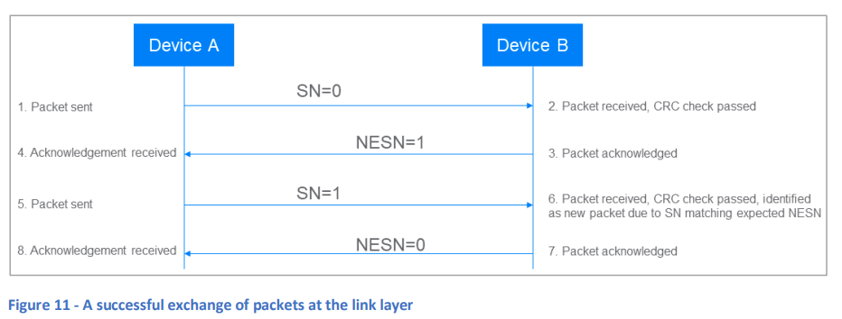  

デバイスBが誤ったSN値を持つパケットを受信した場合、そのパケットは前回受信したパケットの再送と見なし、確認応答は行いますが、スタックには渡されません。

デバイスAがデバイスBから予期しないNESN値を受信した場合、または応答がまったく受信されなかった場合、最初に送信したのと同じSN値を持つパケットを再送信します。コントローラの実装によっては、通信が失敗したと結論するまでに再送回数を決定する異なるアルゴリズムが実装されています。図12は、リンク層の再送を示しています。  

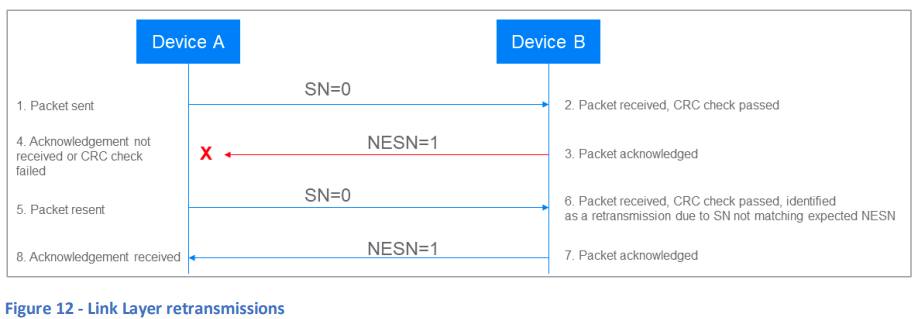  

各パケットには**CRCフィールド**が含まれており、暗号化されたパケットには**MICフィールド**も含まれます。パケットが受信されると、リンク層はCRCおよび（存在する場合は）MICをチェックします。どちらかのチェックが失敗した場合、パケットは確認されず、通常はパケットの送信元が再送を行います。図13は、CRCの失敗を処理するリンク層の動作を示しています。  

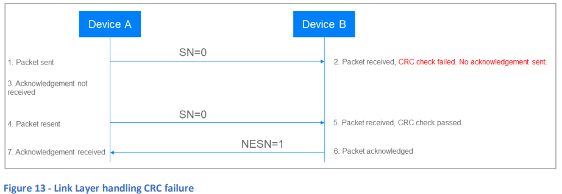  

##### 7.6.1.3 ペリフェラル遅延

ペリフェラルデバイスは、すべての接続イベントでセントラルデバイスからのパケットをリッスンする必要はありません。**ペリフェラル遅延パラメータ**は、ペリフェラルがリッスンしなくてもよい連続した接続イベントの数を定義します。これにより、ペリフェラルは電力を節約できます。図14は、ペリフェラル遅延が1に設定されており、したがってペリフェラルが交互の接続イベントのみにリッスンしている動作を示しています。ペリフェラルがリッスンしていないイベントでセントラルがパケットを送信することも可能ですが、そのパケットは受信されず、確認応答も行われないため、接続イベントは終了します。  

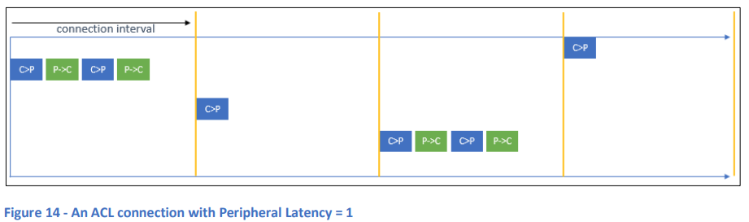  

##### 7.6.1.4 チャネルの使用

LE-ACLでは、**適応周波数ホッピング**と呼ばれる方式を採用しています。各接続イベントの開始時に、周波数ホッピングが行われ、チャネル選択アルゴリズムを使用して利用可能なチャネルセットから無線チャネルが決定論的に選択されます。接続中の各デバイスは、選択されたチャネルに切り替え、時間の経過とともに接続イベントが続くにつれて、2.4 GHz帯域に分布するさまざまなチャネルを頻繁に変更しながら通信を行います。これにより、衝突が発生する確率が大幅に低減します。

Bluetooth LEで使用される40のチャネルのうち、**37のチャネル（汎用チャネル）**がLE-ACL接続で利用可能です。

ある環境では、干渉などにより、Bluetooth無線チャネルの一部がうまく機能しないことがありますが、他のチャネルは信頼性が高く機能することがあります。時間が経つにつれて、信頼できるチャネルと信頼できないチャネルのリストは、他の無線通信デバイスの出入りに応じて変化する可能性があります。

接続中のセントラルデバイスは、汎用チャネルを使用中または未使用として分類する**チャネルマップ**を保持しています。このチャネルマップはリンク層の手順を使用してペリフェラルと共有され、どのチャネルが使用され、どのチャネルが使用されないかについて、両者が同じ情報を持つようにします。チャネル選択アルゴリズムは、未使用と指定されたチャネルを回避することを保証します。

デフォルトでは、すべての汎用チャネルが使用中に指定されていますが、セントラルデバイスは独自の技術を使用して各チャネルの動作状況を監視できます。セントラルデバイスが、1つ以上のチャネルが十分に機能していないと判断した場合、それらのチャネルの分類をチャネルマップで未使用に更新できます。逆に、以前問題のあったチャネルが現在はうまく機能していることが判明した場合、その分類を使用中に更新できます。チャネルマップの更新は、ペリフェラルデバイスと共有されることがあります。

ペリフェラルデバイスも独自にチャネルを監視し、一定の間隔で、各チャネルの状態を「良好」「不良」「不明」と分類して、セントラルデバイスに**チャネルステータスレポート**を送信することができます。セントラルは、これを受けて、自身の無線状態とペリフェラルデバイスが経験している条件の両方を考慮した上で、チャネルマップの分類に関する判断を下すことができます。

このようにして、Bluetooth LEデバイスは、利用可能なチャネルの最適なサブセットのみを使用することが可能となり、例えば、静的に割り当てられたチャネルを使用する他の無線技術と効果的に共存できるようになります。これが、Bluetoothの適応周波数ホッピングシステムの**適応性**の側面です。

**注意**: 規制当局は、Bluetooth Core Specificationとは異なる形で適応周波数ホッピングや関連する用語を定義している場合があります。製品開発の初期段階でターゲット市場のスペクトラム使用に関する規制を確認することが推奨されます。これは、特定の実装上の判断に影響を与える可能性があります。

図15は、テスト中に2つの接続デバイスで使用されたチャネルの様子を示しており、2.4 GHzのISM帯域にわたる無線使用がどのように分散しているかを示しています。チャートの下部には、チャネルインデックスとMHzでの周波数が示されています。チャネルインデックスは、無線チャネルを間接的に参照するための方法です。

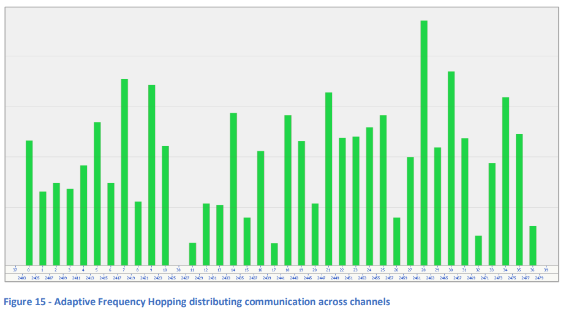  

#### 7.6.1.5 リンク層制御

リンク層の仕様には、さまざまな制御手順が定義されています。以下に例をいくつか示します（表3）。

| **制御手順**                         | **説明**                                                                                                    |
| ----------------------------------- | ---------------------------------------------------------------------------------------------------------- |
| **接続更新 (Connection Update)**      | セントラルまたはペリフェラルデバイスが接続パラメータ（接続間隔、ペリフェラル遅延、監視タイムアウト）の変更を要求します。                |
| **チャネルマップ更新 (Channel Map Update)** | セントラルデバイスが最新のチャネルマップデータを接続されたペリフェラルに転送します。                                         |
| **暗号化 (Encryption)**              | セントラルまたはペリフェラルがパケットの暗号化を有効にします。                                                                       |
| **機能交換 (Feature Exchange)**       | セントラルまたはペリフェラルが、それぞれがサポートするリンク層機能をビットマップフィールドとして交換します。                               |
| **定期アドバタイジング同期転送 (Periodic Advertising Sync Transfer)** | セントラルまたはペリフェラルが、発見した定期アドバタイジング列車に関連する同期情報をLE ACL接続を介して他のデバイスに転送します。 |
| **CIS作成手順 (CIS Creation Procedure)** | セントラルデバイスがペリフェラルとともに**接続型アイソクロナスストリーム (CIS)** を作成します。                                  |
| **電力制御要求 (Power Control Request)** | あるピアがもう一方のピアに対して送信電力レベルの調整を要求します。                                                                 |
| **チャネル分類レポート (Channel Classification Reporting)** | ペリフェラルがセントラルにチャネル分類データを報告します。                                                                       |

**表3 - リンク層制御手順の例**

---

#### 7.6.1.6 サブレート接続

**サブレート接続**は、追加の特性を持ち、通常の接続とは異なる動作をするLE ACL接続です。追加の特性には、サブレートファクタ、サブレートベースイベント、継続番号が含まれます。

サブレート接続の特性は、接続イベントの特定のサブセットだけがアクティブに使用されることを示し、他の接続イベントでは無線が使用されません。そのため、サブレート接続は、短いACL接続間隔を持ちながらも低デューティサイクルを維持することができます。

図16は、サブレート接続に関連する基本概念を示しています。  

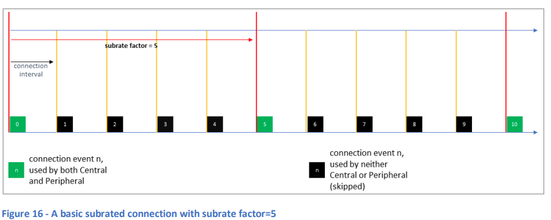  

この例では、5つの接続イベントのうち1つだけが使用され、他の4つはスキップされるため、それらの接続イベントでは無線のアクティビティがありません。この使用される接続イベントとスキップされる接続イベントの比率は、サブレートファクタパラメータによって決定されており、この例では5に設定されています。

無線を使用してリンク層パケットの送受信が行われる接続イベントは、**サブレート接続イベント**として知られています。

ACL接続パラメータとサブレート接続を制御するパラメータとの関係を考えると、サブレート接続は、ACL接続イベントが発生する頻度を制御する**接続間隔**と、サブレートパラメータが適用された後に実際に使用されるACL接続イベントの頻度を決定する**効果的な接続間隔**の両方を持つと考えることができます。

サブレート接続では、異なるリンク層制御手順が使用され、特にサブレート接続パラメータの更新手順は、一般的な接続更新手順とは異なります。重要なのは、サブレート接続パラメータの変更はほぼ即座に適用されるのに対し、一般的なパラメータの変更には適用までに時間がかかる場合があるという点です。したがって、サブレート接続の利点は、低デューティサイクルで消費電力が少ない持続的な接続を確立でき、ユーザーが気づくほどの遅延なく高デューティサイクルの高帯域接続に切り替えられる点にあります。この機能は、補聴器やスマートフォンを含むLEオーディオシナリオに特に適用されます。

**Bluetooth Core Specification Version 5.3 Feature Enhancements**には、サブレート接続に関する詳細な章が含まれており、さらなる情報源として推奨されます。

### 7.6.2 ADVB - LE アドバタイジングブロードキャスト

#### 7.6.2.1 基本事項

**LEアドバタイジングブロードキャスト**（単にアドバタイジングとも呼ばれる）は、接続レスの通信モードを提供します。これは、データの転送や、ペリフェラルデバイスが接続可能であることを示すために使用されます。一般的に、アドバタイジングパケットは範囲内のすべてのスキャンデバイスによって受信されることを意図しており、そのため、アドバタイジングは1対多のトポロジーで同時に複数のスキャンデバイスにデータを転送するために使用されます。ただし、特定の形式のアドバタイジングとして、**ダイレクトアドバタイジング**と呼ばれるものが定義されており、これは1つのアドバタイジングデバイスから、Bluetoothデバイスアドレスで識別された特定のスキャンデバイスにデータを送信する接続レス通信を可能にします。

アドバタイジング自体は、アドバタイジングデバイスからスキャンデバイスへの**一方向通信**のみをサポートしていますが、スキャンデバイスは、さらなる情報の要求や接続の確立を要求するPDUでアドバタイジングパケットに応答することができます。スキャンデバイスがさらなる情報を取得するために応答する場合、**アクティブスキャン**を実行しているとされ、応答しない場合は**パッシブスキャン**を実行しているとされます。

アドバタイジングは、一般に**信頼性の低いトランスポート**と見なされ、受信側からの確認応答が送信されません。

アドバタイジング手順は、2つのカテゴリに分類されており、**レガシーアドバタイジング**と**拡張アドバタイジング**と呼ばれています。

#### 7.6.2.2 レガシーアドバタイジング

##### 7.6.2.2.1 チャネルの使用とパケットサイズ

レガシーアドバタイジングパケットは、**ADV_IND PDUタイプ**を使用し、長さは37オクテット、ヘッダーが6オクテット、ペイロードが最大31オクテットです。アドバタイジングパケットの同一のコピーは、チャネル37、38、39として知られる**プライマリアドバタイジングチャネル**で、1度に1つのチャネルで送信され、ある順序で送信されます。

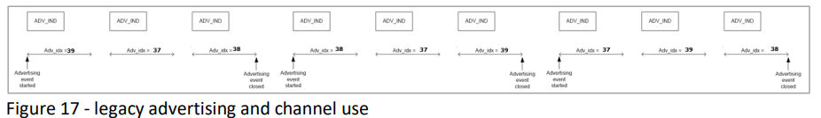  

##### 7.6.2.2.2 スケジューリング

アドバタイジングパケットの送信は、アドバタイジングイベントが発生するたびに行われます。アドバタイジングイベントのスケジューリングは、タイミングパラメータによって制御され、基本的な場合、他のアドバタイジングデバイスとの継続的な衝突を避けるために、若干不規則に設定されます。**advDelay**という値が、各アドバタイジングイベントで0〜10ミリ秒の疑似ランダム値に設定され、これが通常の**アドバタイジング間隔 (advInterval)** に追加されることで、アドバタイジングイベントの時間が微調整されます。図18は、Bluetooth Core SpecificationのVolume 6, Part B, Figure 4.5を再現しており、**advDelay**パラメータの効果を示しています。  

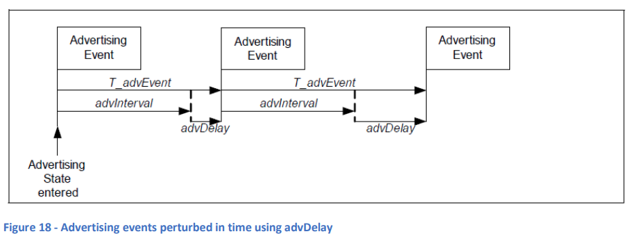  

このようにアドバタイジングイベントをスケジューリングすることで衝突を避けるのに役立ちますが、受信機が効率的にアドバタイジングパケットを受信するのが難しくなり、アドバタイジングイベントの予測不可能なタイミングに対応するために、受信側のRXデューティサイクルを高くする必要があります。

##### 7.6.2.2.3 レガシーアドバタイジングおよび関連するPDUタイプ

レガシーアドバタイジングで使用されるために定義されたPDUタイプはいくつかあります。PDUタイプは、パケットがスキャンデバイスに宛てられているか（**アンダイレクトアドバタイジング**）や、特定のデバイスに宛てられているか（**ダイレクトアドバタイジング**）、アクティブスキャンが許可されているか、アドバタイジングデバイスが接続可能かなどを示します。すべてのレガシーアドバタイジングは、プライマリチャネル（チャネル37、38、39のいずれか）で行われ、**LE 1M PHY**のみを使用できます。

表4は、レガシーアドバタイジングで使用されるPDUをリストしています。

| **PDU名**          | **説明**                                          | **チャネル** | **PHY** | **送信者** | **スキャン可能** | **接続可能** |
| ------------------ | ----------------------------------------------- | ----------- | ------- | -------- | ------------- | ------------- |
| **ADV_IND**        | アンダイレクトアドバタイジング                      | プライマリ    | LE 1M    | ペリフェラル | はい            | はい            |
| **ADV_DIRECT_IND** | ダイレクトアドバタイジング                          | プライマリ    | LE 1M    | ペリフェラル | いいえ          | はい            |
| **ADV_NONCONN_IND**| アンダイレクト、非接続、非スキャン可能アドバタイジング | プライマリ    | LE 1M    | ペリフェラル | いいえ          | いいえ          |
| **ADV_SCAN_IND**   | アンダイレクト、スキャン可能アドバタイジング         | プライマリ    | LE 1M    | ペリフェラル | はい            | いいえ          |
| **SCAN_REQ**       | スキャン要求                                        | プライマリ    | LE 1M    | セントラル   | N/A            | N/A            |
| **SCAN_RSP**       | スキャン応答                                        | プライマリ    | LE 1M    | ペリフェラル | N/A            | N/A            |
| **CONNECT_IND**    | 接続要求                                            | プライマリ    | LE 1M    | セントラル   | N/A            | N/A            |

**表4 - レガシーアドバタイジングPDUs**

Bluetooth Core Specificationのリンク層仕様書のセクション4.4には、すべてのアドバタイジングPDUタイプに関する詳細が記載されています。

### 7.6.2.3 拡張アドバタイジング

Bluetooth Core Specificationバージョン5では、アドバタイジングの方法に大きな変更が導入されました。アドバタイジング、スキャン、接続に関連する8つの新しいPDUが追加され、新しい手順が定義されました。この新しいアドバタイジング機能のセットは、**拡張アドバタイジング**として知られています。

拡張アドバタイジングでは、より大量のデータをブロードキャストできるようになり、アドバタイジングが決定論的なスケジュールで実行され、異なる構成に基づいて複数の異なるアドバタイジングデータセットが送信できるようになりました。また、競合やデューティサイクルに関しても大幅な改善がなされています。

拡張アドバタイジングは、**ADVB** および **PADVB** 論理トランスポートの両方で使用されます。

#### 7.6.2.3.1 チャネルの使用とパケットサイズ

無線チャネルの使用方法は、レガシーアドバタイジングとは異なり、プライマリアドバタイジングチャネル37、38、39ではデータが少なく、汎用チャネル0〜36でほとんどのデータが送信されます。

セクション7.6.2.2「レガシーアドバタイジング」で説明されているように、レガシーアドバタイジングでは、同じペイロードが最大3回、異なる3つのプライマリアドバタイジングチャネルで送信されます。これに対して、拡張アドバタイジングでは、ペイロードデータは一度だけ送信され、プライマリチャネルでは小さなヘッダーでその参照が行われます。このため、レガシーアドバタイジングに比べて送信されるデータ量は少なくなり、デューティサイクルも低減します。  

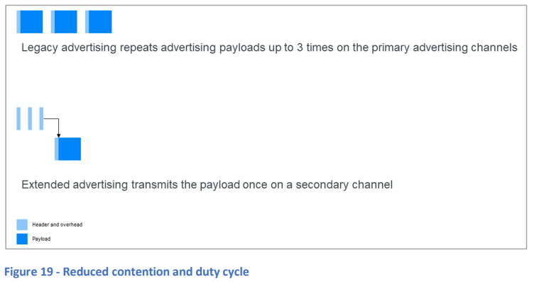  

拡張アドバタイジングでは、最大255オクテットのパケットを送信することができます。これは、ペイロードを汎用チャネル0〜36のいずれかにオフロードすることによって実現されます。  

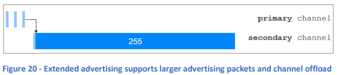  

拡張アドバタイジングを実行する際には、プライマリチャネル（チャネル37、38、39）にはヘッダーデータのみが送信されます。このヘッダーには**AuxPtrフィールド**が含まれており、汎用チャネルで送信されるペイロードを含む補助パケットを参照します。**AuxPtr**には、補助パケットが送信される汎用チャネルのインデックスが含まれており、受信機がそのチャネルでデータを取得できるようにします。プライマリチャネルのパケットで参照される汎用チャネルのパケットは**従属パケット**と呼ばれ、参照するプライマリチャネルのパケットは**上位パケット**と呼ばれます。

AuxPtrのチャネルインデックス値の選択は実装に依存しており、Bluetooth Core Specificationでは「衝突を避けるために十分なチャネルの多様性を使用する」ことが推奨されています。

#### 7.6.2.3.2 パケットのチェイニング

アプリケーションがさらに大量のデータ（最大1,650バイト）をブロードキャストする必要がある場合、コントローラはデータを断片化して、複数のパケットをチェイン（連鎖）させることができます。それぞれのパケットは、そのデータの一部を含んでおり、各チェインパケットは異なるチャネルで送信されます。AuxPtrヘッダーフィールドはチェイン内の次のパケットを参照します。図21はこれを示しています。  

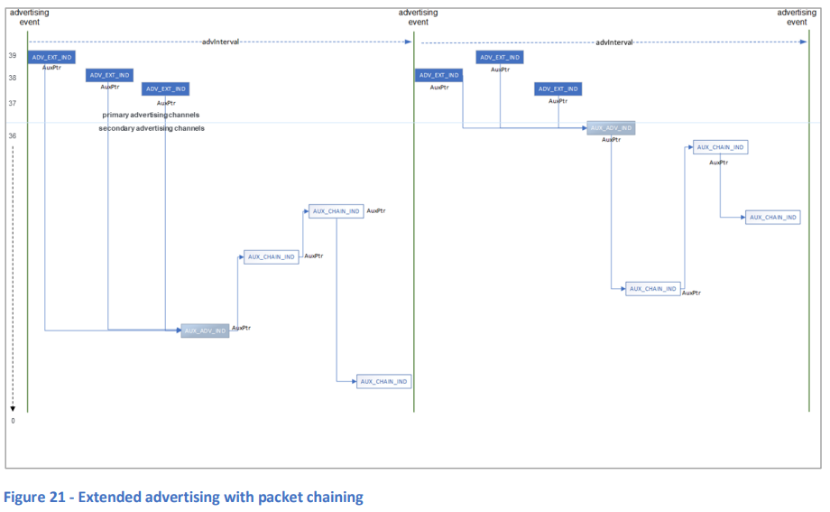  

#### 7.6.2.3.3 アドバタイジングセット

レガシーアドバタイジングでは、アドバタイジングのペイロードやパラメータを変更する正式な手段は提供されていません。しかし、拡張アドバタイジングには、複数の異なるアドバタイジングデータセットを持つための標準的なメカニズムが含まれています。

アドバタイジングセットには、各パケットがどのセットに属しているかを示すための**ID**が付与されており、各セットには独自のアドバタイジングパラメータ（アドバタイジング間隔や使用するPDUタイプなど）が設定されます。

異なるアドバタイジングセットのスケジューリングと送信のタスクは、ホストではなくコントローラ内のリンク層によって処理されます。ホストが担当すると電力効率が低下するためです。ホストは、最初にコントローラにアドバタイジングセットとそれぞれのパラメータを通知するだけで、その後はリンク層が管理を行います。

#### 7.6.2.3.4 定期アドバタイジング

拡張アドバタイジングには、決定論的なスケジューリングを使用するアドバタイジングの方法が含まれており、その詳細はスキャンデバイスによって発見され、同期されることがあります。これを**定期アドバタイジング**と呼びます。定期アドバタイジングは、独立した論理トランスポートとして定義されており、セクション7.6.3「PADVB - LE定期アドバタイジングブロードキャスト」で説明されています。

#### 7.6.2.3.5 拡張アドバタイジングおよび関連するPDUタイプ

拡張アドバタイジングで使用するためにいくつかのPDUタイプが定義されています。以下の表5は、拡張アドバタイジングのPDUをリストしています。

| **PDU名**          | **説明**                                       | **チャネル**      | **PHY**                        | **送信者**   |
| ------------------ | -------------------------------------------- | --------------- | ---------------------------- | -------- |
| **ADV_EXT_IND**    | 拡張アドバタイジング                               | プライマリ         | LE 1M, LE Coded                | ペリフェラル |
| **AUX_ADV_IND**    | 従属拡張アドバタイジング                           | 汎用チャネル        | LE 1M, LE 2M, LE Coded         | ペリフェラル |
| **AUX_CHAIN_IND**  | 追加のアドバタイジングデータ                        | 汎用チャネル        | LE 1M, LE 2M, LE Coded         | ペリフェラル |
| **AUX_SYNC_IND**   | 定期アドバタイジング同期                           | 定期チャネル        | LE 1M, LE 2M, LE Coded         | ペリフェラル |
| **AUX_SCAN_REQ**   | 補助スキャン要求                                   | 汎用チャネル        | LE 1M, LE 2M, LE Coded         | セントラル   |
| **AUX_SCAN_RSP**   | 補助スキャン応答                                   | 汎用チャネル        | LE 1M, LE 2M, LE Coded         | ペリフェラル |
| **AUX_CONNECT_REQ**| 補助接続要求                                       | 汎用チャネル        | LE 1M, LE 2M, LE Coded         | セントラル   |
| **AUX_CONNECT_RSP**| 補助接続応答                                       | 汎用チャネル        | LE 1M, LE 2M, LE Coded         | ペリフェラル |

**表5 - 拡張アドバタイジングPDUs**

**ADV_EXT_IND**、**AUX_ADV_IND**、**AUX_SCAN_RSP**、**AUX_SYNC_IND**、**AUX_CHAIN_IND**、および**AUX_CONNECT_RSP**のPDUのペイロードは、**共通拡張アドバタイジングペイロードフォーマット**で定義されています。これには、**AuxPtrフィールド**や**AdvMode**などのフィールドが含まれています。**AdvMode**は、接続可能性やスキャン可能性を示すために2ビットを使用し、個別のPDUタイプを区別します。

リンク層仕様書のBluetooth Core Specificationの第4.4章には、すべてのアドバタイジングPDUタイプの詳細が記載されています。

#### 7.6.2.3.6 スケジューリング

拡張アドバタイジングは、**拡張アドバタイジングイベント**で行われます。拡張アドバタイジングイベントは、アドバタイジングイベントと同時に開始され、**AuxPtrフィールド**を持つ上位パケットと、それに関連する従属パケットを含みます。

#### 7.6.2.4 レガシーアドバタイジングと拡張アドバタイジングの比較

以下の表6は、レガシーアドバタイジングと拡張アドバタイジングの比較を示しています。

| **項目**                    | **レガシーアドバタイジング**          | **拡張アドバタイジング**                                         |
| --------------------------- | ------------------------------------ | ------------------------------------------------------------- |
| **ホストがサポートする最大アドバタイジングデータサイズ** | 31バイト                              | 1,650バイト 拡張アドバタイジングは断片化をサポートし、50倍の最大ホストアドバタイジングデータサイズをサポートします。 |
| **パケットごとの最大アドバタイジングデータサイズ**  | 31バイト                              | 254バイト 拡張アドバタイジングPDUは、8倍大きなアドバタイジングデータフィールドをサポートする共通拡張アドバタイジングペイロードフォーマットを使用します。 |
| **送信チャネル**                 | 37, 38, 39                           | 0-39 拡張アドバタイジングは、37の汎用チャネルをセカンダリアドバタイジングチャネルとして使用します。ただし、**ADV_EXT_IND** PDUタイプはプライマリアドバタイジングチャネル（37, 38, 39）のみで送信されます。 |
| **PHYサポート**                | LE 1M                                | LE 1M、LE 2M（**ADV_EXT_IND PDU**を除く）、LE Coded すべての拡張アドバタイジングPDUは、**ADV_EXT_IND**を除いて、いずれかのLE PHYで送信できますが、**ADV_EXT_IND**はLE 1MまたはLE Coded PHYでのみ送信されます。 |
| **最大アクティブアドバタイジング構成数**       | 1                                    | 16 拡張アドバタイジングにはアドバタイジングセットが含まれ、アドバタイジングデバイスが最大16の異なるアドバタイジング構成を同時にサポートし、各セットの時間間隔に従ってアドバタイジングをインターリーブできます。 |
| **通信タイプ**                 | 非同期                                | 非同期、同期 拡張アドバタイジングには**定期アドバタイジング**が含まれ、送信機と受信機の間でアドバタイジングデータの時間同期通信を可能にします。 |

**表6 - レガシーアドバタイジングと拡張アドバタイジングの比較**

### 7.6.3 PADVB - LE 定期アドバタイジングブロードキャスト

#### 7.6.3.1 基本事項

**ADVB** 論理トランスポートによって実行されるアドバタイジング（セクション7.7.2参照）では、アドバタイジングパケット送信のタイミングにある程度のランダム性が含まれています。アドバタイジングイベントのスケジューリングには0〜10msのランダムな遅延が挿入され、持続的なパケット衝突を避けるための工夫がされています。レガシーアドバタイジングでは、この方法が唯一のアドバタイジングの動作方法です。

**定期アドバタイジング**は、決定論的なスケジュールに基づいてパケットを送信し、他のデバイスがアドバタイジングデバイスのスケジュールに同期してスキャンできる仕組みを提供します。定期アドバタイジングは常にスキャン不可能で、接続不可能です。

定期アドバタイジングは、スキャンデバイスにとって電力効率の高いスキャン方法を提供し、LEオーディオのブロードキャストソリューションにおける重要な要素です。

アドバタイジングは**定期アドバタイジング間隔**と呼ばれる固定間隔で行われ、アドバタイジングデータのペイロードは変更される場合があります。**AUX_SYNC_IND**および関連する**AUX_CHAIN_IND** PDUの一連の送信は、**定期アドバタイジングトレイン**を形成します。

各定期アドバタイジングイベントでは、最初に1つの**AUX_SYNC_IND PDU**が送信され、その後、ホスト提供のペイロードが断片化を必要とするかどうかに応じて、0個以上の**AUX_CHAIN_IND PDU**が送信されます。

**AUX_ADV_IND PDU**には、チャネルとタイミングのオフセット情報を含む**SyncInfoフィールド**が含まれています。

#### 7.6.3.2 チャネルの使用

定期アドバタイジングは、37の汎用アドバタイジングチャネルを使用します。各定期アドバタイジングイベントの開始時に、**チャネル選択アルゴリズム2**を使用して、チャネルが選択されます。この選択は、**paEventCounter**というイベントカウンターフィールドを入力として行われます。このカウンターは、各定期アドバタイジングイベントで増加します。**AUX_SYNC_IND PDU**に関連する補助の**AUX_CHAIN_IND PDU**は、実装固有のアルゴリズムでチャネルが選択され、その選択は**AuxPtrフィールド**に指定されます（図22参照）。  

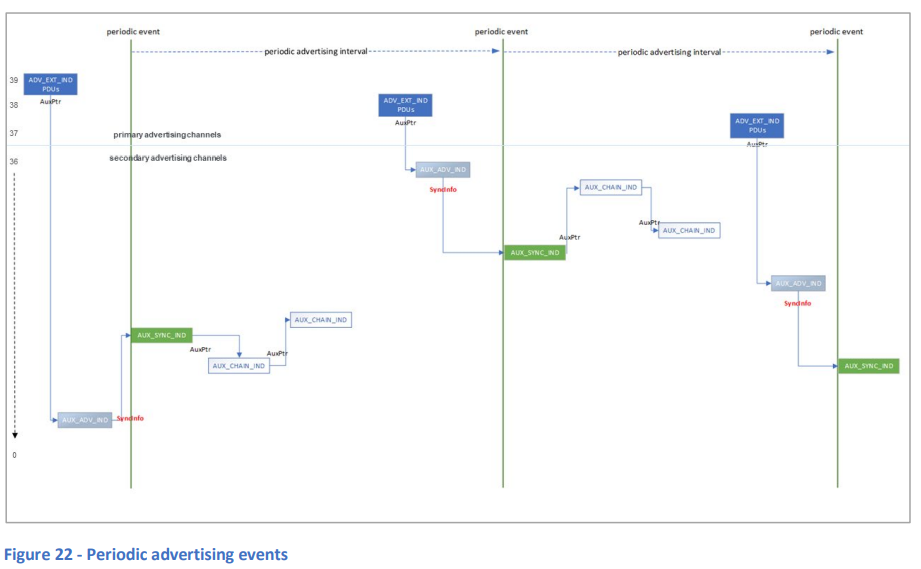  

#### 7.6.3.3 スケジューリング

定期アドバタイジング間隔は、特定のアドバタイジングセットに対して定期アドバタイジングが行われる頻度を決定します。この間隔は、**AUX_SYNC_IND PDU**の送信で始まり、その後、0個以上の**AUX_CHAIN_IND PDU**のシリーズが続きます（図22参照）。

#### 7.6.3.4 同期の確立

スキャンデバイスは、2つの方法のいずれかで定期アドバタイジングトレインに同期することができます。1つは、**AUX_ADV_IND PDU**をスキャンして、**SyncInfoフィールド**の内容を使用して、定期アドバタイジングの間隔、タイミングオフセット、チャネル情報を確立する方法です。もう1つは、他のデバイスからこの情報をLE-ACL接続経由で受け取る方法です。この他のデバイス自体が**AUX_ADV_IND PDU**からこの情報を取得しています。この方法は、**Periodic Advertising Sync Transfer (PAST)**手順として知られています。

### 7.6.4 PAwR - LE 定期アドバタイジングと応答

#### 7.6.4.1 基本事項

**PAwR (Periodic Advertising with Responses)** は、いくつかの点で**PADVB**（定期アドバタイジングブロードキャスト）に似ています：

- **PADVB**は、1つのデバイス（ブロードキャスター）が1つまたは複数の受信デバイス（オブザーバー）にアプリケーションデータを送信し、1対多の通信トポロジーを形成します。**PAwR**でも同様です。
- **PAwR**と**PADVB**の両方が、接続レス通信方式を使用します。
- アドバタイジングパケットの送信は定期的で、スケジュールにランダムな変動はありません。
- オブザーバーは、**AUX_ADV_IND PDU**または**Periodic Advertising Sync Transfer (PAST)**手順を使用して、ブロードキャスターが使用する定期送信スケジュールを確立できます。

**PAwR**は、次の点で**PADVB**とは異なります：

- **PADVB**は、ブロードキャスターからオブザーバーへの一方向のデータ通信をサポートしますが、**PAwR**のオブザーバーはブロードキャスターに応答パケットを送信できます。**PAwR**は、双方向の接続レス通信メカニズムを提供します。
- **PADVB**の定期アドバタイジングの同期情報は、**AUX_ADV_IND PDU**の**SyncInfoフィールド**に含まれますが、**PAwR**の同期情報は**SyncInfoフィールド**と**ACADフィールド**に含まれます。
- **PADVB**では、ブロードキャスターはアドバタイジングイベント内で送信スケジュールを設定しますが、**PAwR**では、ブロードキャスターは一連のイベントとサブイベントで送信スケジュールを設定し、オブザーバーは特定のサブイベントでのみリスニングするように同期します。
- **PAwR**のブロードキャスターは、特定のデバイスに接続要求（**AUX_CONNECT_REQ PDU**）を送信して、LE-ACL接続を確立することができます。**PADVB**にはこの機能はありません。
- **PADVB**では、アプリケーションデータは時間とともに変わることが多いですが、**PAwR**はアプリケーションデータが頻繁に変わることを前提に設計されています。
- **PADVB**では、同じアプリケーションデータが同じアドバタイジングセットに同期しているすべてのオブザーバーデバイスに配信されますが、**PAwR**では、異なるデータが各オブザーバーデバイスまたはデバイスのセットに配信される可能性があります。

**Periodic Advertising Sync Transfer (PAST)** 手順は、**PADVB**ではオプションですが、**PAwR**では必須です。

### 7.6.4.2 チャネルの使用

チャネルの選択は**チャネル選択アルゴリズム2**を使用して行われ、各定期アドバタイジングサブイベントごとに実施されます（詳細は7.7.4.3「スケジューリング」参照）。サブイベントで送信されるPDUへの応答も同じチャネルを使用します。これには、**AUX_SYNC_SUBEVENT_IND PDU**に応答して送信される**AUX_SYNC_SUBEVENT_RSP PDU**や、**AUX_CONNECT_REQ PDU**に応答して送信される**AUX_CONNECT_RSP PDU**が含まれます。

### 7.6.4.3 スケジューリング

他のアドバタイジングモードと同様に、PAwRにおける活動は**イベント**内で行われ、PAwRの場合はこれを**定期アドバタイジングと応答イベント（PAwRイベント）**と呼びます。これらのイベントは、スケジューリングにランダムな変動がない状態で、固定間隔で発生します。イベントは、毎定期アドバタイジング間隔（ミリ秒単位）で開始されます。

各PAwRイベントは、いくつかの**サブイベント**で構成されており、アドバタイジングパケットはサブイベント内で送信されます。ホストは、イベントごとのサブイベント数を最大128まで設定できます。サブイベントは、毎定期アドバタイジングサブイベント間隔（ミリ秒単位）で開始されます。ホストは、サブイベントごとの数と定期アドバタイジングサブイベント間隔を、**HCI_LE_Set_Periodic_Advertising_Parameters V2**（またはそれ以降）というホストコントローラインターフェイス（HCI）コマンドを使用して設定します。

図23は、PAwRイベントとサブイベントの構造を示しています。  

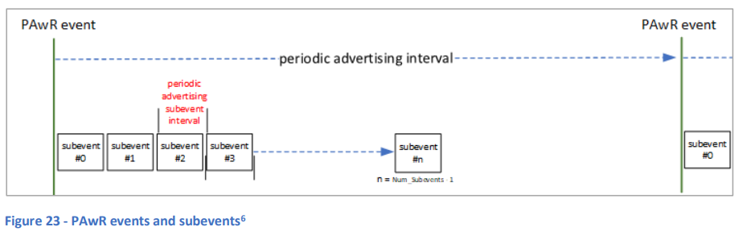  

**図23 - PAwRイベントとサブイベント**

各サブイベント内で、ブロードキャスターは1つのパケットを送信します。このパケットには通常、**AUX_SYNC_SUBEVENT_IND PDU**が含まれますが、代わりに**AUX_CONNECT_REQ PDU**が含まれる場合もあります。その後、**定期アドバタイジング応答スロット遅延**と呼ばれる遅延の後、同じサブイベント内で、オブザーバーデバイスからの応答を受信するための一連のタイムスロットが予約されます。**AUX_SYNC_SUBEVENT_IND PDU**への応答は、**AUX_SYNC_SUBEVENT_RSP PDU**で送信されます。ホストは、必要な応答スロット数を**HCI_LE_Set_Periodic_Advertising_Parameters**コマンドで設定します。図24は、PAwRサブイベントの構造を示しています。  

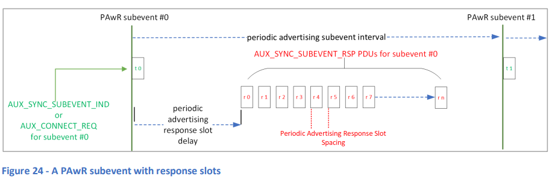  

**図24 - 応答スロットを含むPAwRサブイベント**

### 7.6.4.4 同期の確立

#### 概要

**同期のプロセス**は、オブザーバーデバイスがアドバタイジングデバイスによって送信される関連するパケットを効率的にスキャンし、受信するために必要な情報を提供します。**PAwR**の場合、同期には以下の3つの側面があります。

1. **定期アドバタイジングと応答イベントの発生頻度と次回イベントの発生時間**をオブザーバーデバイスが把握する必要があります。この情報は、**定期アドバタイジング間隔**というパラメータと、**syncPacketWindowOffset**という計算された値で提供されます。
2. **サブイベントに関する情報**も必要です。これには、サブイベントの発生頻度、各定期アドバタイジングイベントで含まれるサブイベントの数、および各サブイベント内で応答を送信するために予約されたタイムスロットに関する詳細が含まれます。この情報は、以下のパラメータに含まれています: **Subevent_Interval**、**Num_Subevents**、**Response_Slot_Delay**、**Response_Slot_Spacing**、および**Num_Response_Slots**。
3. 最後に、オブザーバーデバイスは、**どのサブイベント番号をスキャンすべきか**、**どの応答スロットを使用すべきか**、および**応答パケットに使用するアクセスアドレス**を知る必要があります。

1と2の情報を取得することで、オブザーバーデバイスはPAwRアドバタイジングトレインのイベントおよびサブイベントのタイミングパラメータと構造について完全な理解を得ることができます。しかし、3の情報を取得するまでは、期待されるデータを含むパケットだけを受信するためのスキャンのスケジュール設定や、応答パケットを送信するスケジュールの設定ができません。

1と2は、**PAwR論理トランスポート**によって処理され、Bluetooth Core Specificationに定義されています。この同期情報を取得するための手順として、2つの選択肢があります。これらの手順については、**定期アドバタイジング同期情報のスキャン**および**Periodic Advertising Sync Transfer (PAST)** のセクションで説明しています。

3に関しては、アプリケーション層で処理される必要があり、例えば**Electronic Shelf Label (ESL)**プロファイルなど、関連するBluetoothプロファイル仕様に定義される可能性があります。

#### 定期アドバタイジング同期情報のスキャン

PAwRおよびPADVBは、それぞれが**スキャン**によって定期アドバタイジング同期情報を取得するために似た手順を使用します。

PAwRおよびPADVBの両方では、オブザーバーデバイスはセカンダリアドバタイジングチャネル上で送信される**AUX_ADV_INDパケット**をスキャンします。**AUX_ADV_IND**には、**SyncInfoフィールド**が含まれており、これには**定期アドバタイジング間隔**の値および**syncPacketWindowOffset**を計算するためのデータ項目が含まれています。この2つの値を取得することで、オブザーバーデバイスは、いつ定期アドバタイジングイベントが発生するかを計算できます（概要の1項目目を参照）。

PAwRでは、概要の2項目目に示されているように、同期手順を完了するためにサブイベントおよび応答スロットに関する情報も必要です。この情報は、定期アドバタイジング間隔が取得された同じ**AUX_ADV_IND PDU**内の、**Additional Controller Advertising Data (ACAD)**フィールドにある**Periodic Advertising Response Timing Information**というADタイプに含まれています。

#### Periodic Advertising Sync Transfer (PAST)

PAST手順を使用する場合、同期パラメータを接続経由で転送するデバイスは、他のデバイスの代わりにスキャンを行って最初に情報を取得することがあります。しかし、PAwRの場合、PASTのサポートは必須であるため、PAwRブロードキャスターは、必要な同期データを**LE ACL接続**を介してオブザーバーデバイスに転送できます。このアプローチが取られる場合、どちらのデバイスも**AUX_ADV_IND PDU**をスキャンする必要はありません。

#### サブイベントの同期および応答スロットの割り当て

**サブイベント同期**は、オブザーバーデバイスに対して、どのサブイベントでスキャンを行うべきかを示すためのものです。複数のオブザーバーデバイスが同じサブイベントに同期することが可能です。また、個々のオブザーバーデバイスは、1つ以上のサブイベント中にデータを受信するように同期することができます。

さらに、オブザーバーデバイスが応答PDUを送信できるためには、どのサブイベントの応答スロットを使用するかを決定するための基準が必要です。

これらの点はすべてアプリケーション層の責任で処理されます。

### 7.6.5 LE BISおよびLE CIS - アイソクロナス通信

このセクションでは、**アイソクロナス通信**の主要な側面について説明します。追加情報については、Nick Hunn著の「**Introducing Bluetooth LE Audio**」を参照してください。この書籍は電子書籍として無料でダウンロード可能です（[こちらから](https://www.bluetooth.com/bluetooth-resources/le-audio-book/)）。Bluetooth Core Specificationには、詳細が記載されています。

#### 7.6.5.1 基本事項

**アイソクロナス通信**は、Bluetooth LEを使用してデバイス間で時間制約のあるデータを転送するための方法です。複数のシンクデバイスが異なるタイミングで同じソースからデータを受信し、そのデータの処理を同期させるメカニズムを提供します。LE Audioはアイソクロナス通信を利用します。

アイソクロナス通信を使用する場合、データには有効期限が設定されており、その期限が過ぎるとデータは**期限切れ**となります。期限切れのデータは送信されていない場合に破棄されるため、デバイスは常にプロファイルが規定するデータの**年齢**や**許容遅延**に基づいて有効なデータのみを受信します。

データは**アイソクロナスストリーム**で転送され、これらのストリームは**アイソクロナスグループ**に属します。デバイスは、同じグループのすべてのストリームが関連するパケットを配信するまでの一定時間待機し、その後、同時に受信したパケットを処理します。例えば、ステレオ音楽が2つのストリーム、1つは左チャンネル用、もう1つは右チャンネル用として配信される場合があります。これら2つのストリームは同じグループに属し、受信したパケットは同時にレンダリングされるため、ユーザーは意図したとおりにステレオ音楽を聞くことができます。

アイソクロナス通信に使用される2つの論理トランスポートが定義されています。**接続型アイソクロナスストリーム (LE CIS)** は、接続指向の通信を使用し、双方向のデータ転送をサポートします。一方、**ブロードキャストアイソクロナスストリーム (LE BIS)** は、接続レスのブロードキャスト通信を使用し、一方向のデータ通信を提供します。

#### 7.6.5.2 接続型アイソクロナスストリーム

##### 7.6.5.2.1 CISの概要

**CISストリーム**は、2つの接続されたデバイス間での**ポイントツーポイントアイソクロナス通信**を提供し、**CIS PDU**と呼ばれるリンク層PDUでデータを転送します。図25に示されているように、**LE-CIS（CIS）論理トランスポート**は、Bluetoothの全体的なデータトランスポートアーキテクチャ内で表されています。

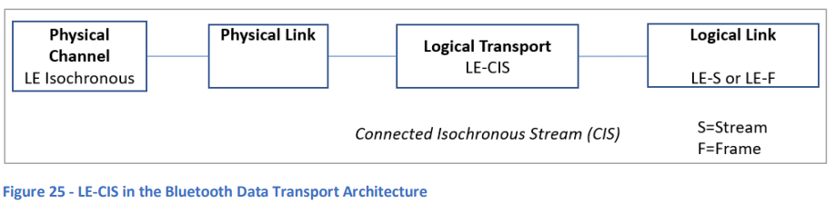  
図25 - BluetoothデータトランスポートアーキテクチャにおけるLE-CIS

2つの論理リンク、**LE-S** および **LE-F** が定義されており、これらは非フレーム（LE-S）およびフレーム（LE-F）データの両方をサポートします。**LE-S**と**LE-F**の使用は、**アイソクロナス適応層**に関わる問題です。

**CISストリーム**は**LEアイソクロナス物理チャネル**を使用し、Bluetooth LE PHYのいずれも使用可能です。CISは双方向通信をサポートしており、**確認応答プロトコル**が使用されます。

CISストリームは、**接続型アイソクロナスグループ (CIG)** というグループに属し、各グループには1つ以上のCISが含まれることがあります（図26参照）。1つのCIGあたり最大31のCISを含むことができますが、実際の利用可能なエアタイムやその他の実装詳細によって、この上限は低くなることがあります。

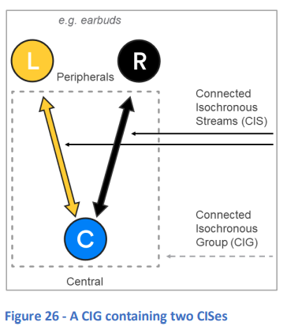  
図26 - 2つのCISを含むCIG

##### 7.6.5.2.2 チャネルの使用

**接続型アイソクロナスストリーム**は、**チャネル選択アルゴリズム2**を使用した**適応周波数ホッピング**を行います。

### 7.6.5.2.3 スケジューリング

**CIG**（接続型アイソクロナスグループ）およびそのメンバーである**CIS**（接続型アイソクロナスストリーム）のスケジューリングは、**CIGイベント**、**CISイベント**および**サブイベント**のシステムによって管理されます。

**CIGイベント**は、CIGに属するすべてのCISに対してアクティビティのスケジューリングを開始する合図であり、これはグループ内の最初のCISの**アンカーポイント**で発生します。CIGイベントは、**ISO_Interval**というパラメータで指定された間隔で発生します。

各CISイベントは、1つ以上のサブイベントに分割されます。使用されるサブイベントの数は、**NSE**というストリームパラメータで示されます。接続型アイソクロナスストリームでは、サブイベント中に**セントラルデバイス**が一度送信し（T）、**ペリフェラルデバイス**が応答（R）します（図27参照）。サブイベントは、**Sub_Interval**というCISパラメータで指定された期間で間隔が設定されます。サブイベントが1つしかない場合、**Sub_Interval**は常に0に設定されますが、複数のサブイベントがある場合は、最低でも400マイクロ秒、かつISO_Intervalより短く設定されます。

各サブイベントごとにチャネルが変更されます。CIGイベント中に、各CISは順次サービスされるか、または異なるCISのサブイベントがインターリーブされる可能性があります。図27では、3つのCISを含むCIGが、各CISが順次サービスされる例を示しています。

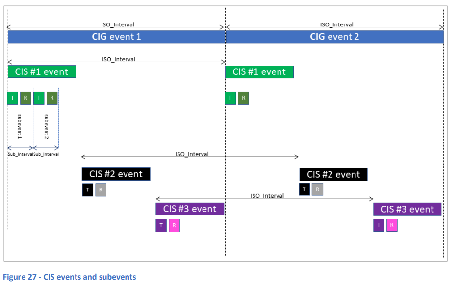  
**図27 - CISイベントとサブイベント**

各CISには、**Number of Subevents (NSE)** 以外にも、**Flush Timeout (FT)** および**Burst Number (BN)** といった重要なパラメータがあります。

各ペイロード（例: LC3などのオーディオコーデックによって生成されるオーディオデータのチャンク）は、**FT**パラメータによって指定されたCISイベント数内で正常に送信（確認応答を含む）される必要があります。各CISイベントのサブイベントごとに送信が試みられ、FTイベント内で成功しなかった場合、パケットは**フラッシュ（破棄）**されます。また、異なるデータ（ペイロード）を含む複数のPDUが同時に利用可能である場合があり、CISでは同じCISイベント中に複数の異なるPDUを送信することができます。このとき、各CISイベントでサービスできる異なるPDUの数は、**Burst Number (BN)** パラメータで指定されます。

### 7.6.5.2.4 処理の同期

CIGには、**CIG_Sync_Delay** というタイミングパラメータが関連付けられています。同様に、CIG内の各CISには**CIS_Sync_Delay**というタイミングパラメータがあり、これはグループ内のすべてのストリームでのアイソクロナスデータ処理（通常はオーディオレンダリング）を同期するために使用されます。受信デバイスは、このパラメータで示された時間待機してから、受信したデータをレンダリングします。

  
**図28 - CIG内のCISデータの同期レンダリング**

図28に示されているように、各ストリームには異なる**CIS_Sync_Delay**値が設定されています。CIG内の最初のCISストリームでは、この値はグループレベルのパラメータ**CIG_Sync_Delay**に設定されます。グループ内の他のストリームについては、CIS_Sync_Delayは段階的に小さな値に設定されます。これにより、グループ内で早く処理されたストリームを受信したデバイスは、後から送信されたストリームのパケットを受信するデバイスよりも長い時間待機してからレンダリングを行います。上位層の仕様（プロファイルなど）では、さらに**プレゼンテーション遅延**を使用して、データがレンダリングされる時間を計算し、ローカルの処理遅延を考慮に入れることが規定される場合があります。この段階的な遅延システムの結果、すべてのシンクデバイスは同時に受信データを処理します。

### 7.6.5.2.5 CISストリームの作成

**CIS**を確立するには、最初に**ACL接続**を確立する必要があります。この接続は、リンク層制御PDUを交換するための役割を果たすと同時に、CISイベントをスケジュールする際のタイミング参照点を提供します。

**CISの作成手順**は常にセントラルデバイスが開始します。セントラルデバイスは、**LL_CIS_REQ PDU**というリンク層制御PDUを送信します。問題がなければ、ペリフェラルデバイスが**LL_CIS_RSP PDU**で応答し、セントラルデバイスが**LL_CIS_IND PDU**を送信した時点でストリームが確立されたと見なされます。このPDUには、CISイベントのタイミングおよびレンダリング前に適用する遅延を決定する重要なパラメータが含まれています。具体的には、**CIS_Offset**はACLアンカーポイント（接続イベントで最初のパケットが送信される時間）と、ストリームの最初のCISイベントの間のオフセット（マイクロ秒単位）を提供します。**CIG_Sync_Delay**には、マイクロ秒単位でのCIG全体の同期遅延値が含まれ、**CIS_Sync_Delay**には、このストリームで使用される同期遅延値が含まれます。

ストリームが作成された後は、ACL接続とは独立して並行して実行されます。しかし、ACL接続が終了すると、関連するCISも終了する必要があります。

### 7.6.5.2.6 CISの暗号化

CISで使用されるリンクは、ピアデバイスがペアリングされている場合、暗号化することができます。

### 7.6.5.3 ブロードキャストアイソクロナスストリーム (BIS)

#### 7.6.5.3.1 BISの概要

**BIS (Broadcast Isochronous Stream)** は、1つの送信デバイス（ソース）と複数の受信デバイス（シンク）の間でアイソクロナス通信を提供します。データは、**BIS Data PDU**としてリンク層PDUで送信され、制御情報は**BIS Control PDU**で送信されます。

**LE-BIS (BIS)** 論理トランスポートは、Bluetoothデータトランスポートアーキテクチャ内で図29に示されています。

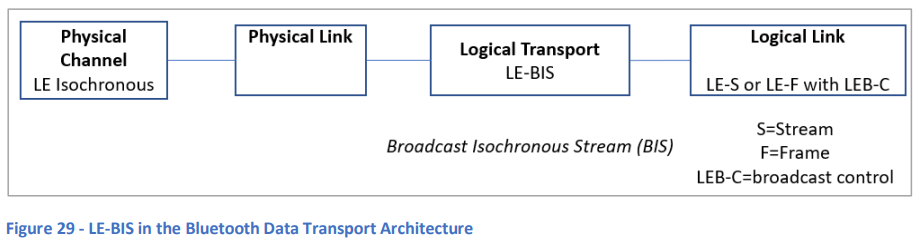  
**図29 - BluetoothデータトランスポートアーキテクチャにおけるLE-BIS**

BISでブロードキャストされるデータは、フレーム化される場合とされない場合があります。これに応じて、**LE-S**（非フレーム）と**LE-F**（フレーム）という論理リンクタイプが定義されており、**LEB-C** 論理リンクが制御情報を運びます。

BISストリームは、**LEアイソクロナス物理チャネル**を使用し、Bluetooth LEのPHYを使用できます。BISストリームは、**BIG (Broadcast Isochronous Group)** というグループに属し、各BIGには1つ以上のBISが含まれます（図30参照）。

  
**図30 - 2つのBISを含むBIG**

1つのBIGには最大31のBISを含むことができますが、利用可能なエアタイムやその他の実装詳細により、この上限は低くなる場合があります。

**BIS**は、**一方向通信**のみをサポートします。**CIS**と異なり、BISには**確認応答プロトコル**が組み込まれていません。これにより、BISトランスポートは本質的に信頼性が低いものとなりますが、これを補うために、**無条件パケット再送信**のシステムが使用されます。BISではペリフェラルの応答のためのスロットを予約する必要がないため、（CISとは異なり）同じエアタイムで倍のサブイベントをスケジュールでき、信頼性を高める再送信の機会が増えます。さらに、再送信は異なるサブイベントで行われ、それぞれ異なるチャネルで送信されます。選択されたチャネルは、前回の送信から少なくとも6 MHz離れている必要があり、これにより特定のチャネルでの干渉によるパケット損失が軽減されます。

#### 7.6.5.3.2 チャネルの使用

**ブロードキャストアイソクロナスストリーム**は、**チャネル選択アルゴリズム2**を使用した適応周波数ホッピングを行います。

#### 7.6.5.3.3 スケジューリング

**BIG**およびそのメンバーである**BIS**のスケジューリングは、**BIGイベント**、**BISイベント**および**サブイベント**のシステムによって管理されます。さらに、**BIG全体に関連する制御PDU**を送信するための特別な制御サブイベントが定義されています。

**BIGイベント**は、BIGに属するすべてのBISに対してアクティビティのスケジューリングを開始する合図です。**BISイベント**は、**BIS_Spacing**というBIGパラメータで指定された値の倍数の間隔で開始され、BIGのアンカーポイント（開始地点）から計算されます。

各BISイベントは、1つ以上のサブイベントに分割されます。使用されるサブイベントの数は、**NSE**というストリームパラメータで示されます。サブイベント中に、ブロードキャスターは1つのパケットを送信します。通信は一方向であり、パケットを受信する必要はありません。サブイベントは、**Sub_Interval**というBIGパラメータで指定された間隔で分割されます。

**接続型アイソクロナスグループ（CIG）**の場合と同様に、BIG内でのBISイベントのスケジューリングは、**順次**または**インターリーブ**で行われる場合があります。

BIGイベントには、常にBIGの最終サブイベントとしてスケジュールされる**制御サブイベント**を含むことがあります。各サブイベントごとにチャネルが変更されます。

図31では、BIGおよびBISイベントとサブイベントのスケジューリング例が順次の配置で示されています。図の終わりには、**BIG制御サブイベント (Tc)** がBIGイベント#1の終わりに送信されていることが示されています。

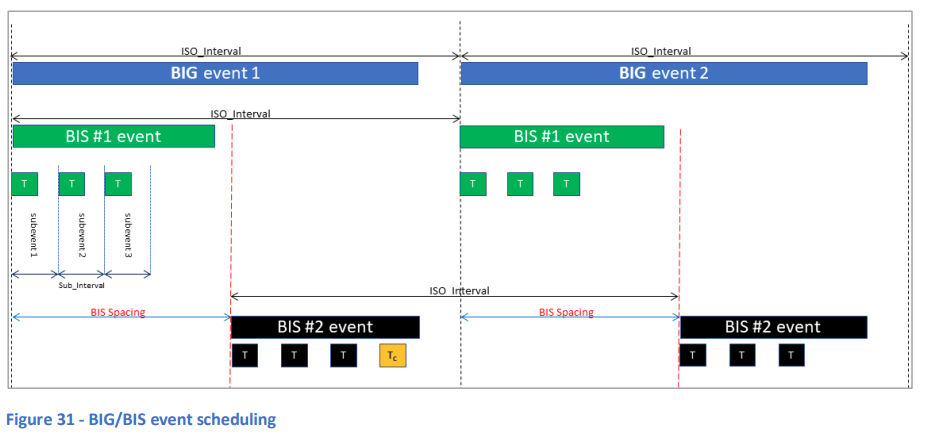  
**図31 - BIG/BISイベントスケジューリング**

#### 7.6.5.3.4 処理の同期

BIG内のブロードキャストアイソクロナスストリーム間でのデータの同期処理は、接続型アイソクロナス通信で使用される方法と同様の方法で実現されます。受信デバイスは、BIGおよびその全体的なパラメータに関する情報を持ち、どのストリームを受信するかを選択します。BIGのタイミングパラメータは、すべてのストリームに均一に適用されます。受信デバイスは、**BIG_Sync_Delay**値と**BIS_Spacing**パラメータを使用して、他のストリームと同期してデータを処理するまでの待機時間を計算します。

### 7.6.5.3.5 BISストリームの作成

デバイスがBIS内でブロードキャストされるパケットを受信し、同じ**BIG**（Broadcast Isochronous Group）に属する他のストリームを受信するデバイスと同じタイミングでそのパケットの内容をレンダリングまたは処理するためには、まずデバイスは**BIG**とそのパラメータを発見する必要があります。これには、含まれるストリームの数、各ストリームに関連するイベントの間隔、サブイベント間の間隔、タイミングアンカーポイントを計算するためのオフセット情報などが含まれます。このプロセスをサポートするために、ブロードキャスターは**定期アドバタイジング**を使用して必要なパラメータを伝達します。**BIGInfo**と呼ばれる複合フィールドが、**AUX_SYNC_IND PDU**内の**ACAD**（Additional Controller Advertising Data）フィールドでブロードキャストされ、必要なデータを含んでいます。

**BIGInfo**を受信する方法は2つあります。1つ目は、受信デバイスが定義された手順を使用して、直接**定期アドバタイジングトレイン**に同期し、**AUX_SYNC_IND PDU**を受信し、その中の**ACAD**フィールドから**BIGInfo**を抽出する方法です。しかし、定期アドバタイジングトレインのスキャンと同期は、電力消費が大きいプロセスです。2つ目の方法では、デバイスは、通常はより多くの電力資源を持つ別のデバイスに、定期アドバタイジングトレインの発見と同期を委任します。スキャンを委任されたデバイスが**BIGInfo**を取得した後、その情報をより効率的な**ACL接続**を介して、ブロードキャストアイソクロナスストリームを受信したいデバイスに転送します。この手順は**Periodic Advertising Sync Transfer (PAST)**と呼ばれます。

### 7.6.5.3.6 BIGの暗号化

**BIG**は暗号化される場合があります。この暗号化には、BISを受信するデバイスがブロードキャストデバイスとペアリングされている必要はありません。その代わりに、暗号化キーの生成に使用される**Broadcast Code**パラメータを配布する必要があります。これは、バンド外（out of band）で行われるか、上位レベルのプロファイルで定義された手順に従って行われます。

### 7.6.5.4 再送信と信頼性

**BIS**や**CIS**ストリームでは、サブイベントの連続中に同一パケットの再送信を行うことで信頼性を向上させることができます。BISの場合、再送信は無条件で行われますが、CISではペリフェラルが送信を確認しなかった場合に再送信が行われます。

**BIS**では、ペリフェラルの応答スロットを予約する必要がないため（CISとは異なり）、同じエアタイムで倍のサブイベントをスケジュールできるため、信頼性を高める再送信の機会が増えます。再送信は、異なるサブイベントに割り当てられており、異なるチャネルで送信されます。選択されるチャネルは、前回の送信から少なくとも6 MHz離れている必要があり、これにより特定のチャネルでの干渉によるパケット損失が軽減されます。

### 7.6.5.4 LEオーディオ

**LEアイソクロナス通信**は主にオーディオ製品やシステムでの使用を目的に設計されました。これにより、ソースから複数のシンクに提供されるオーディオが同時にレンダリングされ、正しく同期された再生が実現されます。
