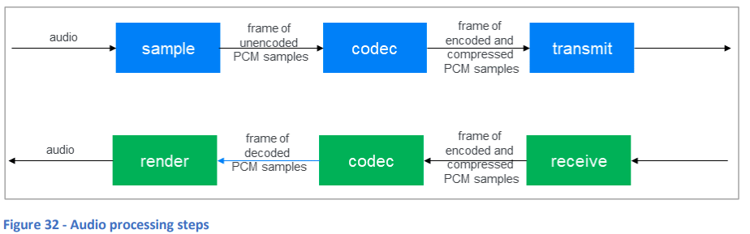
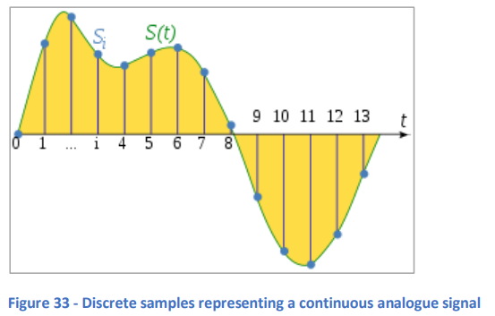
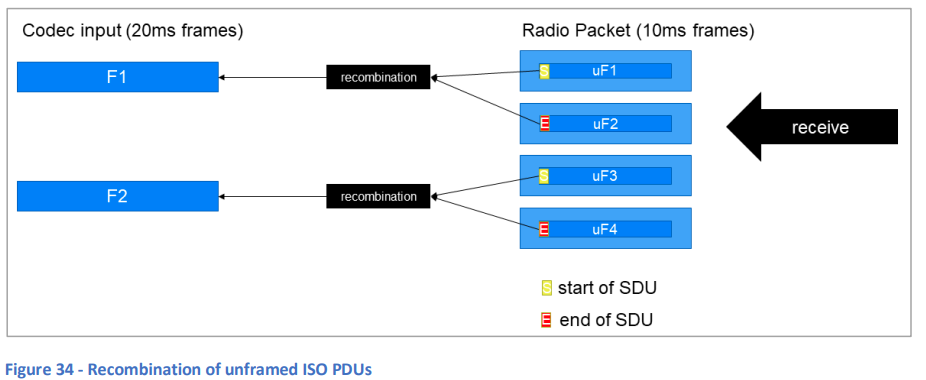
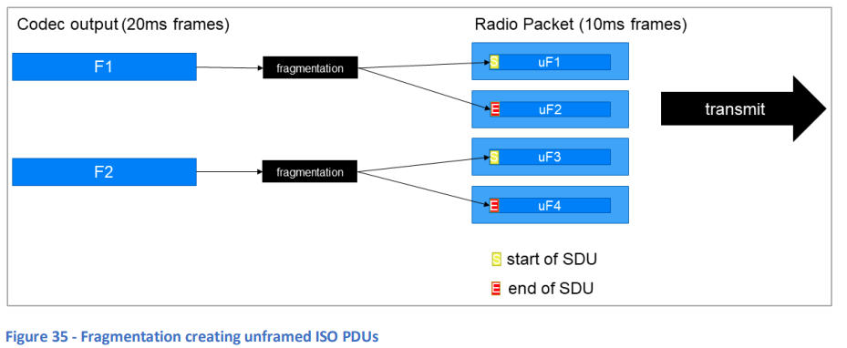
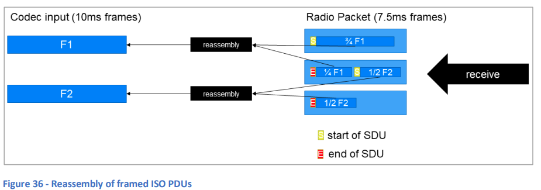
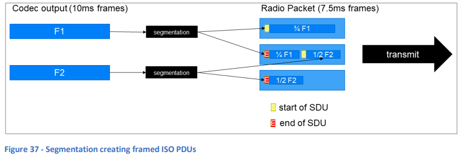

# 8. アイソクロナス適応層 (ISOAL)

## 8.1 基本事項
**アイソクロナス適応層 (ISOAL)** の目的は、接続型およびブロードキャスト型アイソクロナス通信において、特にオーディオデバイスに関連する潜在的な問題に対処することです。また、ISOALは他のアイソクロナス通信の用途でも使用される可能性があります。Nick Hunnの「**Introducing Bluetooth LE Audio**」の第5.2章でこのトピックが詳しく説明されていますので、参照をお勧めします。

### 8.1.1 オーディオサンプリング101
デジタルオーディオは、**アナログオーディオ信号をサンプリング**し、そのサンプルデータに対してコーデックを適用して圧縮やその他の処理を行い、保存またはBluetooth LEオーディオの場合には送信します。エンコードされたデジタルオーディオデータを読み取るか受信すると、デコーディングされ、一連のデジタルサンプルが生成されます。これらのサンプルは、元のアナログオーディオをおおよそ再現するために使用されます。図32は、オーディオ信号のサンプリング、エンコード、送信、そしてエンコードされたオーディオデータを受信し、デコードし、最終的にレンダリングするまでの過程を示しています。

  
**図32 - オーディオ処理のステップ**

オーディオコーデックの主要な目標の1つは、限られた帯域幅で効率的にデータを送信できるよう、オーディオデータのサイズを削減することです。**サンプリング**は、信号の振幅を一定間隔で測定し記録するプロセスです。サンプルが記録される頻度は**サンプルレート**と呼ばれます。図33の縦線は、連続的に変動するオーディオ信号（曲線）をサンプリングした結果を示しています。この一連のサンプルにより、元のアナログ信号の近似的な表現が作成されます。サンプルが頻繁に取られるほど（つまり、サンプルレートが高いほど）、その近似は元の信号に近くなり、プロセスを逆にして元のオーディオを再現したときに、結果がより良くなり、品質も向上します。

サンプリングのもう1つの重要な側面は**ビット深度**です。サンプルされた信号の振幅は整数値で表現する必要があります。たとえば、可能な振幅値の範囲を256個の離散的な振幅帯に分け、0から255までの数値でそれぞれを表す方法があります。この場合、1つのサンプルには1バイト（8ビット）が必要です。このように、ビット深度が大きいほど、振幅を表現するシステムが詳細になり、より高品質な結果が得られる可能性があります。しかし、ビット深度が増加すると、それに応じてデータ量も増加します。

たとえば、44.1kHzのサンプルレートで、ビット深度が24ビットの3分間の曲をサンプリングすると、そのデータ量は約24メガバイトになります。これを通信リンクで送信する場合、帯域幅の制約が問題となります。ここで**コーデック**が役立ちます。

  
**図33 - 連続するアナログ信号を表す離散サンプル**

### 8.1.2 コーデックとフレーム
Bluetooth LEオーディオで使用される**LC3コーデック**は、サンプルデータを元の25%以下に圧縮することができますが、実際の結果は元のオーディオコンテンツに大きく依存します。コーデックは、連続したサンプル内のパターンを認識して圧縮を行います。コーデックが機能するには、分析およびエンコードするために一連のサンプルが必要です。この一連のサンプルは**フレーム**と呼ばれ、通常、フレームの持続時間はミリ秒単位で測定されます。

オーディオ製品によってフレーム持続時間は異なる場合があります。10msや7.5msが一般的です。あるデバイスが一方のフレーム持続時間でオーディオを生成し、もう一方のデバイスが異なるフレーム持続時間を使用してオーディオを消費する場合、この違いを解決する必要があります。ここで**ISOAL**が役立ちます。

## 8.2 フレームありとフレームなし

デバイスがアイソクロナス通信を使用する場合、送信デバイスと受信デバイスで使用するフレームの持続時間が異なる可能性があります。これにより、次の2つの状況が発生します。

1. **一方のデバイスが使用するフレーム持続時間が、他方のデバイスのフレーム持続時間の正確な倍数である場合。**
2. **一方のデバイスのフレーム持続時間が、他方のデバイスのフレーム持続時間の正確な倍数ではない場合。**

最初の状況では、フレーム持続時間の関係は単純であり、2つの異なる持続時間間でデータを変換するのは容易です。この場合、1つまたは複数のリンク層PDUのペイロードに送信されるデータは**フレームなし**とされ、2つの持続時間要件間でフレーム持続時間を適応させるための追加データは含まれません。

2番目の状況では、リンク層PDUは、より大きなペイロードの一部と、開始、継続、またはフレームの終了を示す短いヘッダーフィールドを含む場合があります。このようにフォーマットされたデータは**フレームあり**とされます。

**接続型アイソクロナスPDU**および**ブロードキャストアイソクロナスPDU**（リンク層で定義）はどちらも**LLID**というフィールドを持ち、リンク層PDUのペイロードにフレームありのデータが含まれているか、フレームなしのデータが含まれているかを示します。ISOALは、データがフレームありかどうかに応じて、リンク層から受け取ったデータに異なる処理を適用します。同様に、フレーム化が必要かどうかによって、上位層SDUで受け取ったデータをリンク層ISO PDUに渡す際のISOALの処理も異なります。

### 8.3 フラグメンテーションと再結合

**フレームなし**データの場合、再結合プロセスによって、1つまたは複数のリンク層PDUのペイロード内に含まれる1つ以上のフラグメントから1つの**サービスデータユニット (SDU)** が作成されます。ISOALはSDUを上位層に渡します（図34参照）。

  
**図34 - フレームなしISO PDUの再結合**

上位層SDUをリンク層PDUに分割し、フレーム化が不要な場合、このプロセスは**フラグメンテーション**と呼ばれます（図35参照）。

  
**図35 - フラグメンテーションによって作成されたフレームなしISO PDU**

フレームなしのPDUには、SDUの開始、前回のSDUの継続、またはSDUの終了を示すフィールドを含むヘッダーがあります。PDUには常にフレームなしSDUの1つのフラグメントのみが含まれます。

### 8.4 セグメンテーションと再組立て

**フレームあり**データの場合、再組立てプロセスによって、1つまたは複数のリンク層PDUのペイロード内に含まれる1つ以上のセグメントから1つの**サービスデータユニット (SDU)** が作成されます。ISOALはSDUを上位層に渡します（図36参照）。

  
**図36 - フレームありISO PDUの再組立て**

上位層SDUをリンク層PDUに分割し、フレーム化が必要な場合、このプロセスは**セグメンテーション**と呼ばれます（図37参照）。

  
**図37 - セグメンテーションによって作成されたフレームありISO PDU**

フレームありPDU内のセグメントには、SDUの開始、前回のSDUの継続、またはSDUの終了と、タイミングオフセット情報を示すフィールドを含むヘッダーがあります。フレームありPDUには、複数のフラグメントが含まれる場合があります。
