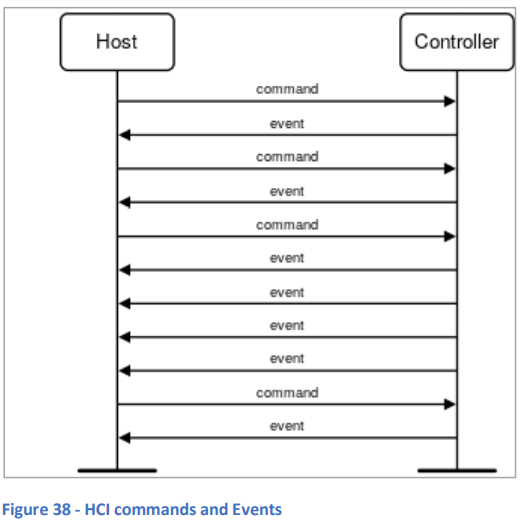
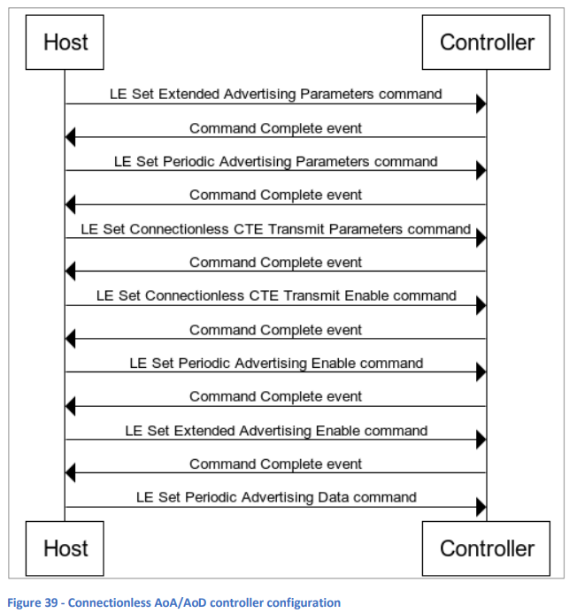
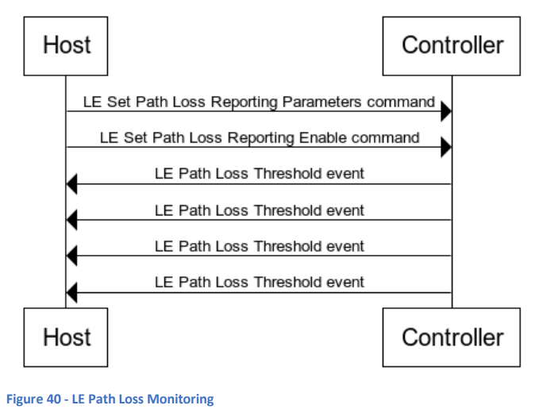
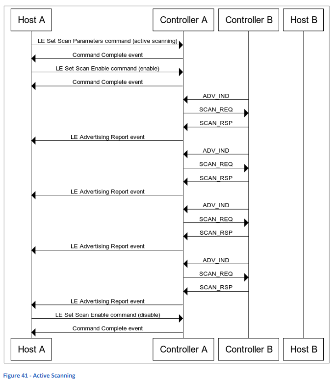

### 9. ホストコントローラインターフェース (HCI)

#### 9.1 基本事項
**ホストコントローラインターフェース (HCI)** は、ホストがコントローラにコマンドを発行し、コントローラがホストと通信するための標準化されたインターフェースを定義します。この仕様は複数のパートに分かれており、最初は機能的な観点からインターフェースを定義し、特定の実装メカニズムには触れません。他のパートでは、HCIを4つの物理的なトランスポートのいずれかを使用して実装する方法が定義されています。

HCIは、Bluetooth LEとBluetooth BR/EDRの両方で使用されます。

#### 9.2 HCI機能仕様
**HCI機能インターフェース**は、コマンドとイベントで定義されます。これらは、ホストとコントローラ間で交換されるメッセージです。コマンドはホストからコントローラに送信され、イベントはコントローラからホストに送信されます。イベントはコマンドに対する応答である場合もあれば、ホストがリクエストしていないメッセージである場合もあります。図38を参照してください。

  
**図38 - HCIコマンドとイベント**

#### 9.3 HCIトランスポート
HCIトランスポートの4つのタイプは次の通りです：
1. UART
2. USB
3. Secure Digital (SD)
4. Three-wire UART

##### 9.3.1 UARTトランスポート
**HCI UARTトランスポート**は、ホストとコントローラが同じ基板上のUARTで接続されている場合に、UARTを使用してHCI通信を実装するために使用されます。5つのパケットタイプに基づいたプロトコルが定義されており、これらはHCIコマンドパケット、HCI ACLデータパケット、HCI同期データパケット、HCIイベントパケット、HCI ISOデータパケットです。

RS232の設定要件も規定されており、要約すると、UARTトランスポートは8ビットデータ、パリティなし、1ストップビット、RTS/CTSフロー制御を使用します。

##### 9.3.2 USBトランスポート
**USB**は、HCIトランスポートとして2つの方法で使用できます。BluetoothコントローラはUSBドングル内に実装することもできますし、USBを製品内で内部的に使用して、ホストとコントローラ間の通信を行うこともできます。

USB標準は、データが送信または受信されるバッファである**エンドポイント**を定義しています。HCI USBトランスポート仕様では、期待されるエンドポイントとそれらの必須または推奨される特性が示されています。

##### 9.3.3 セキュアデジタル (SD)
**HCI SDトランスポート**用のプロトコルは、**セキュアデジタル協会 (SDA)** によって定義および管理されています。Bluetoothコア仕様のHCI SDトランスポートセクションは、主にSDAが管理する外部仕様への参照と、通信アーキテクチャの概要から構成されています。

##### 9.3.4 三線式UART
**三線式UART HCIトランスポート**仕様は、3線接続のUART間でHCIコマンドとイベントを通信するためのアーキテクチャとプロトコルを説明しています。これには、信頼性、データ整合性、リンク確立、電源管理、ハードウェア設定が含まれます。

#### 9.4 HCIの例
いくつかのHCI機能インターフェースの動作例が続きます。

##### 9.4.1 接続なしのAoA/AoD
図39では、ホストがコントローラを設定し、角度到来（**AoA**）または角度出発（**AoD**）技術を使用した方向探知をサポートするパケットの送信を準備するためのHCIコマンドとイベントのやり取りを示しています。

  
**図39 - 接続なしAoA/AoDコントローラ設定**

### 9.4.2 LEパスロスモニタリング
**LEパスロスモニタリング**は、LEパワーコントロール機能の一部です。接続されたピアデバイスが使用する送信電力を管理し、受信側にとって最適な電力範囲内に保つために、この機能を使用することができます。

図40では、ホストがLEパスロスモニタリングを設定し、有効にするために必要なHCIコマンドを送信している様子を示しています。モニタリングが有効になると、コントローラはホストに対して**LE Path Loss Thresholdイベント**を送信し、パスロスデータを提供します。

  
**図40 - LEパスロスモニタリング**

### 9.4.3 アクティブスキャン
**アクティブスキャン**は、レガシーアドバタイジングを利用し、単一のアドバタイジングパケットに含められるデータよりも多くのデータを通信する必要があるペリフェラルによってサポートされます。このトピックについては、セクション13.3「Discovery（発見）」を参照してください。

図41では、デバイスAのホストコンポーネントがコントローラを設定し、アクティブスキャンを実行するように指示し、その後、別のコマンドでスキャンを有効化している様子を示しています。デバイスAのリンク層が他のデバイスからの**ADV_IND**のようなスキャン可能なアドバタイジングパケットを受信すると、アクティブスキャンが設定されているため、**SCAN_REQ PDU**を送信し、他のデバイスから**SCAN_RSP PDU**を受信します。その後、元のアドバタイジングパケットの内容とスキャン応答が、**HCI LEアドバタイジングレポートイベント**の一連のイベントを通じてデバイスAのホストに渡されます。

  
**図41 - アクティブスキャン**
